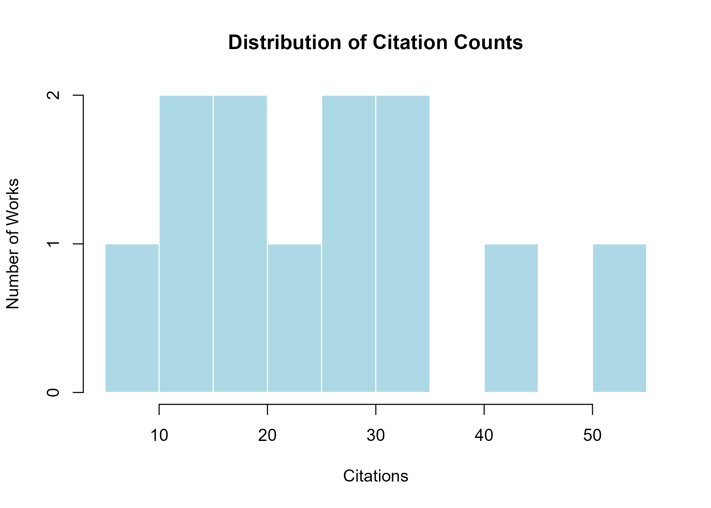

# Descriptive Analysis and Impact Metrics

## 1. Why this vignette exists

### The role of descriptive analysis in bibliometrics

Descriptive analysis serves as the essential first step in any
bibliometric study. Before conducting complex network analyses,
comparative inference, or predictive modeling, researchers must
understand the fundamental characteristics of their corpus. This
vignette provides a comprehensive guide to the descriptive and impact
analysis capabilities of `biblioIntegrator`.

#### Understanding your corpus

Every bibliographic corpus has a story to tell. Descriptive statistics
reveal:

- **Publication patterns**: How has research output evolved over time?
- **Thematic focus**: What topics dominate the literature?
- **Production sources**: Which journals, conferences, or venues publish
  the most?
- **Collaboration structures**: How do authors work together?
- **Citation impact**: How influential are the publications?

#### Why impact metrics matter

Impact metrics quantify scholarly influence beyond simple publication
counts. They help answer questions like:

- Which authors are most productive and influential?
- How do citations accumulate over time?
- What is the relative impact of publications across different fields or
  years?
- Are there emerging topics gaining traction?

#### Text analysis as a window into content

Bibliographic databases contain rich textual information in titles,
abstracts, and keywords. Text analysis techniques—term frequency,
TF-IDF, and trend analysis—reveal:

- **Core terminology**: The most common terms in a field
- **Distinctive vocabulary**: Terms that characterize specific subgroups
  or time periods
- **Emerging themes**: Topics gaining prominence in recent publications

### When to use this vignette

Use this vignette when you need to:

1.  Generate a quick overview of a new bibliographic corpus
2.  Compute standard bibliometric metrics for publication or grant
    reports
3.  Identify the most cited works, authors, or sources
4.  Analyze thematic patterns in titles or abstracts
5.  Compare impact across time periods or subgroups (preliminary)
6.  Present descriptive findings in a publication or thesis

### What this vignette does NOT cover

This vignette focuses on *descriptive* and *text-based* analysis. For
more advanced analyses, see:

- **Comparative inference** (`v04`): Formal statistical tests between
  groups
- **Network analysis** (`v05`): Co-authorship, citation, and keyword
  networks
- **Temporal patterns** (`v06`): Growth models and reference publication
  year spectroscopy

------------------------------------------------------------------------

## 2. Learning objectives

By the end of this vignette, you will be able to:

1.  **Generate descriptive summaries** of a bibliographic corpus using
    [`describe_biblio()`](https://wep69.github.io/biblioIntegrator/reference/describe_biblio.md)
2.  **Compute author-level metrics** including h-index, g-index, and
    m-index with
    [`biblio_metrics()`](https://wep69.github.io/biblioIntegrator/reference/biblio_metrics.md)
3.  **Analyze term frequency** patterns in titles and abstracts using
    [`term_frequency()`](https://wep69.github.io/biblioIntegrator/reference/term_frequency.md)
4.  **Apply TF-IDF analysis** to identify distinctive terms across
    groups using
    [`tfidf_terms()`](https://wep69.github.io/biblioIntegrator/reference/tfidf_terms.md)
5.  **Identify trending topics** over time using
    [`trend_topics()`](https://wep69.github.io/biblioIntegrator/reference/trend_topics.md)
6.  **Understand normalized citations** and their interpretation with
    [`normalized_citations()`](https://wep69.github.io/biblioIntegrator/reference/normalized_citations.md)
7.  **Compute disruption indices** to measure paradigm-shifting
    influence using
    [`disruption_index()`](https://wep69.github.io/biblioIntegrator/reference/disruption_index.md)
8.  **Interpret metrics in context**, avoiding common pitfalls of
    bibliometric indicators
9.  **Apply text analysis** to reveal thematic structure in
    bibliographic data
10. **Create visualizations** of descriptive findings using base R
    graphics

------------------------------------------------------------------------

## 3. Prerequisites

### Required packages

``` r

# Core package
library(biblioIntegrator)

# Optional: enhanced visualizations
if (requireNamespace("plotly", quietly = TRUE)) {
  library(plotly)
}
#> Warning: package 'plotly' was built under R version 4.6.1
#> Loading required package: ggplot2
#> 
#> Attaching package: 'plotly'
#> The following object is masked from 'package:ggplot2':
#> 
#>     last_plot
#> The following object is masked from 'package:stats':
#> 
#>     filter
#> The following object is masked from 'package:graphics':
#> 
#>     layout
```

### Example data

Throughout this vignette, we use the built-in example corpus:

``` r

# Load the example corpus
raw_data <- example_biblio()

# Inspect the structure
str(raw_data)
#> 'data.frame':    12 obs. of  7 variables:
#>  $ title    : chr  "Silicon and salinity tolerance in rice" "Soil carbon under cover crops" "Remote sensing of soybean nitrogen" "Silicon nutrition in maize drought" ...
#>  $ year     : num  2018 2019 2020 2021 2022 ...
#>  $ doi      : chr  "10.1000/agri.1" "10.1000/agri.2" "10.1000/agri.3" "10.1000/agri.4" ...
#>  $ authors  : chr  "Silva A; Pereira W" "Martins B; Costa C" "Lima D; Pereira W" "Silva A; Gomez E" ...
#>  $ keywords : chr  "silicon; salinity; rice" "soil carbon; cover crops" "remote sensing; soybean; nitrogen" "silicon; drought; maize" ...
#>  $ citations: num  42 35 28 31 22 18 55 26 12 9 ...
#>  $ source   : chr  "Field Crops" "Soil Science" "Remote Sensing" "Plant Nutrition" ...
head(raw_data[, c("title", "year", "citations")])
#>                                    title year citations
#> 1 Silicon and salinity tolerance in rice 2018        42
#> 2          Soil carbon under cover crops 2019        35
#> 3     Remote sensing of soybean nitrogen 2020        28
#> 4     Silicon nutrition in maize drought 2021        31
#> 5       Cover crops and soil aggregation 2022        22
#> 6        Machine learning for crop yield 2023        18
```

The example corpus contains 12 agronomy-related publications spanning
2017–2025, with fields:

- `title`: Publication title
- `year`: Publication year
- `doi`: Digital Object Identifier
- `authors`: Semicolon-separated author names
- `keywords`: Semicolon-separated author keywords
- `citations`: Citation count
- `source`: Journal or venue name

### Constructing a project

All analytical functions require a `biblio_project` object:

``` r

# Convert raw data to a project
x <- as_biblio_project(raw_data, source = "tutorial corpus")

# Inspect the project structure
x
#> <biblio_project> 12 works; 7 authors; 32 work-keyword links
head(x$works)
#>     work_id                                  title year            doi
#> 1 W0001f7e3 Silicon and salinity tolerance in rice 2018 10.1000/agri.1
#> 2 W000160f5          Soil carbon under cover crops 2019 10.1000/agri.2
#> 3 W0001b6e0     Remote sensing of soybean nitrogen 2020 10.1000/agri.3
#> 4 W0001b6e2     Silicon nutrition in maize drought 2021 10.1000/agri.4
#> 5 W0001932e       Cover crops and soil aggregation 2022 10.1000/agri.5
#> 6 W00017da4        Machine learning for crop yield 2023 10.1000/agri.6
#>                 source cited_by_count abstract
#> 1          Field Crops             42         
#> 2         Soil Science             35         
#> 3       Remote Sensing             28         
#> 4      Plant Nutrition             31         
#> 5         Soil Science             22         
#> 6 Agricultural Systems             18
head(x$authorships)
#>              work_id author_id
#> Silva A    W0001f7e3 A000008ad
#> Pereira W  W0001f7e3 A00000f73
#> Martins B  W000160f5 A00000f4d
#> Costa C    W000160f5 A000008c4
#> Lima D     W0001b6e0 A00000621
#> Pereira W1 W0001b6e0 A00000f73
head(x$keywords)
#>     work_id        keyword
#> 1 W0001f7e3        silicon
#> 2 W0001f7e3       salinity
#> 3 W0001f7e3           rice
#> 4 W000160f5    soil carbon
#> 5 W000160f5    cover crops
#> 6 W0001b6e0 remote sensing
```

------------------------------------------------------------------------

## 4. Descriptive analysis with `describe_biblio()`

### Function overview

[`describe_biblio()`](https://wep69.github.io/biblioIntegrator/reference/describe_biblio.md)
generates a comprehensive descriptive summary of a bibliographic corpus.
It returns a list with:

| Element           | Description                            |
|-------------------|----------------------------------------|
| `n_documents`     | Total number of works                  |
| `years`           | Range of publication years             |
| `total_citations` | Sum of all citations                   |
| `annual`          | Annual publication and citation counts |
| `top_sources`     | Frequency table of sources             |
| `top_keywords`    | Frequency table of keywords            |

### Basic usage

``` r

# Generate descriptive summary
desc <- describe_biblio(x)

# Total documents
desc$n_documents
#> [1] 12

# Year range
desc$years
#> [1] 2017 2025

# Total citations
desc$total_citations
#> [1] 309
```

### Annual production

``` r

# Annual publication and citation counts
desc$annual
#>   year documents citations
#> 1 2017         1        55
#> 2 2018         1        42
#> 3 2019         1        35
#> 4 2020         2        54
#> 5 2021         1        31
#> 6 2022         2        39
#> 7 2023         1        18
#> 8 2024         2        26
#> 9 2025         1         9
```

The `annual` data frame shows:

- `year`: Publication year
- `documents`: Number of publications
- `citations`: Total citations received

#### Visualizing annual production

``` r

# Plot annual publications
barplot(
  desc$annual$documents,
  names.arg = desc$annual$year,
  main = "Annual Publication Output",
  xlab = "Year",
  ylab = "Number of Publications",
  col = "steelblue",
  border = "white"
)
```


Figure 1. Annual publication output

``` r

# Plot annual citations
barplot(
  desc$annual$citations,
  names.arg = desc$annual$year,
  main = "Annual Citation Accumulation",
  xlab = "Year",
  ylab = "Total Citations",
  col = "darkorange",
  border = "white"
)
```


Figure 2. Annual citation accumulation

### Top sources

``` r

# Most frequent publication sources
desc$top_sources
#> 
#>            Soil Science    Agricultural Systems        Agronomy Reviews 
#>                       2                       1                       1 
#>            Crop Science             Field Crops         Plant Nutrition 
#>                       1                       1                       1 
#>            Plant Stress   Precision Agriculture          Remote Sensing 
#>                       1                       1                       1 
#>            Soil Biology Sustainable Agriculture 
#>                       1                       1
```

#### Interpreting source distribution

A concentrated source distribution may indicate:

- **Field-specific journals**: Specialization in a narrow subfield
- **Database bias**: Overrepresentation of certain venues in the source
  database
- **Regional patterns**: Certain journals dominate in particular regions

``` r

# Visualize top sources (top 8)
top_n <- min(8, length(desc$top_sources))
barplot(
  head(desc$top_sources, top_n),
  main = "Top Publication Sources",
  xlab = "Source",
  ylab = "Number of Publications",
  col = "darkgreen",
  border = "white",
  las = 2,
  cex.names = 0.8
)
```


Figure 3. Top publication sources

### Top keywords

``` r

# Most frequent author keywords
desc$top_keywords
#> 
#>          silicon      cover crops            maize         nitrogen 
#>                3                2                2                2 
#>         salinity             soil          soybean      aggregation 
#>                2                2                2                1 
#>    climate-smart          drought       efficiency machine learning 
#>                1                1                1                1 
#>       management    meta-analysis      phenotyping   remote sensing 
#>                1                1                1                1 
#>             rice         rotation      soil carbon  soil microbiome 
#>                1                1                1                1 
#>           stress              uav            wheat            yield 
#>                1                1                1                1
```

#### Keyword analysis patterns

High-frequency keywords reveal:

- **Core topics**: Central themes in the research domain
- **Methodological approaches**: Common methods or techniques
- **Emerging themes**: New keywords appearing in recent years (see
  Section 7)

``` r

# Visualize top keywords (top 10)
top_kw <- min(10, length(desc$top_keywords))
barplot(
  head(desc$top_keywords, top_kw),
  main = "Top Author Keywords",
  xlab = "Keyword",
  ylab = "Frequency",
  col = "purple",
  border = "white",
  las = 2,
  cex.names = 0.7
)
```


Figure 4. Top author keywords

### Collaboration patterns from descriptions

While
[`describe_biblio()`](https://wep69.github.io/biblioIntegrator/reference/describe_biblio.md)
does not directly compute collaboration metrics, the underlying data
enable basic collaboration analysis:

``` r

# Average authors per document
avg_authors <- nrow(x$authorships) / nrow(x$works)
cat("Average authors per document:", round(avg_authors, 2), "\n")
#> Average authors per document: 2

# Author frequency
author_freq <- sort(table(x$authorships$author_id), decreasing = TRUE)
head(author_freq)
#> 
#> A000008ad A00000f4d A00000f73 A0000043f A00000621 A000008c4 
#>         4         4         4         3         3         3

# Map author IDs to names
author_names <- x$authors$display_name[
  match(names(author_freq), x$authors$author_id)
]
data.frame(
  author = author_names,
  publications = as.integer(author_freq)
)
#>      author publications
#> 1   Silva A            4
#> 2 Martins B            4
#> 3 Pereira W            4
#> 4     Rao F            3
#> 5    Lima D            3
#> 6   Costa C            3
#> 7   Gomez E            3
```

### Geographic distribution (if available)

If your data includes country or affiliation information, geographic
analysis is possible:

``` r

# Example: if affiliations are available in your data
# geo_data <- x$works$country
# table(geo_data)
#
# # For OpenAlex data, affiliations are in the works table
# if ("country_code" %in% names(x$works)) {
#   geo_table <- sort(table(x$works$country_code), decreasing = TRUE)
#   head(geo_table, 10)
# }
```

------------------------------------------------------------------------

## 5. Author-level metrics with `biblio_metrics()`

### Function overview

[`biblio_metrics()`](https://wep69.github.io/biblioIntegrator/reference/biblio_metrics.md)
computes author-level bibliometric indices. It returns a data frame
with:

| Column      | Description              |
|-------------|--------------------------|
| `author`    | Author display name      |
| `documents` | Number of publications   |
| `citations` | Total citations received |
| `h_index`   | Hirsch index             |
| `g_index`   | Egghe’s g-index          |
| `m_index`   | h-index / career length  |

### Basic usage

``` r

# Compute author-level metrics
metrics <- biblio_metrics(x)

# View all metrics
metrics
#>              author documents citations h_index g_index   m_index
#> A0000043f     Rao F         3        61       3       3 0.7500000
#> A00000621    Lima D         3        62       3       3 0.6000000
#> A000008ad   Silva A         4       137       4       4 0.4444444
#> A000008c4   Costa C         3        65       3       3 0.5000000
#> A00000905   Gomez E         3       103       3       3 0.5000000
#> A00000f4d Martins B         4        97       4       4 0.6666667
#> A00000f73 Pereira W         4        93       4       4 0.5000000
```

### Understanding h-index

The **h-index** (Hirsch, 2005) is defined as:

> An author has index *h* if *h* of their papers have at least *h*
> citations each.

``` r

# Example: understanding h-index calculation
# Take an author's citation counts sorted descending
example_citations <- sort(metrics$citations, decreasing = TRUE)[1]
example_h <- metrics$h_index[1]

cat("Example author:", metrics$author[1], "\n")
#> Example author: Rao F
cat("Documents:", metrics$documents[1], "\n")
#> Documents: 3
cat("Total citations:", metrics$citations[1], "\n")
#> Total citations: 61
cat("h-index:", example_h, "\n")
#> h-index: 3
```

#### Properties of h-index

- **Robustness**: Insensitive to a single highly-cited paper
- **Cumulative**: Only increases over time (cannot decrease)
- **Field-dependent**: Varying benchmark values across disciplines
- **Career-stage dependent**: Favors senior researchers

#### Limitations of h-index

``` r

# The h-index cannot capture:
# 1. A researcher with 1 paper with 1000 citations
#    h-index = 1, despite high impact
#
# 2. A researcher with 100 papers each with 10 citations
#    h-index = 10, same as someone with 10 papers with 10 citations
#
# 3. Different career lengths
#    h-index naturally increases with time active
```

### Understanding g-index

The **g-index** (Egghe, 2006) addresses some h-index limitations:

> An author has index *g* if the top *g* papers account for at least
> *g*² citations cumulatively.

``` r

# Compare h and g indices
metrics[, c("author", "h_index", "g_index")]
#>              author h_index g_index
#> A0000043f     Rao F       3       3
#> A00000621    Lima D       3       3
#> A000008ad   Silva A       4       4
#> A000008c4   Costa C       3       3
#> A00000905   Gomez E       3       3
#> A00000f4d Martins B       4       4
#> A00000f73 Pereira W       4       4

# The g-index is always >= h-index
all(metrics$g_index >= metrics$h_index)
#> [1] TRUE
```

#### Properties of g-index

- **Rewards top papers**: Gives more weight to highly-cited works
- **Sensitive to outliers**: A breakthrough paper increases g more than
  h
- **Also cumulative**: Only increases over time

### Understanding m-index

The **m-index** (h-index divided by career length) normalizes for career
stage:

``` r

# m-index: h-index per active year
metrics[, c("author", "h_index", "m_index")]
#>              author h_index   m_index
#> A0000043f     Rao F       3 0.7500000
#> A00000621    Lima D       3 0.6000000
#> A000008ad   Silva A       4 0.4444444
#> A000008c4   Costa C       3 0.5000000
#> A00000905   Gomez E       3 0.5000000
#> A00000f4d Martins B       4 0.6666667
#> A00000f73 Pereira W       4 0.5000000

# Interpretation: higher m-index suggests faster impact accumulation
# But requires careful interpretation for very short careers
```

#### Interpreting m-index

``` r

# Career length calculation
# (internal to biblio_metrics: max_year - min_year + 1)
# m-index = h_index / career_years

# Example interpretation
cat("Author with h=3 in 5 years: m =", round(3/5, 2), "\n")
#> Author with h=3 in 5 years: m = 0.6
cat("Author with h=3 in 2 years: m =", round(3/2, 2), "\n")
#> Author with h=3 in 2 years: m = 1.5
cat("The second author accumulates impact faster\n")
#> The second author accumulates impact faster
```

### Filtering and ranking authors

``` r

# Authors with at least 2 documents
prolific <- subset(metrics, documents >= 2)
prolific
#>              author documents citations h_index g_index   m_index
#> A0000043f     Rao F         3        61       3       3 0.7500000
#> A00000621    Lima D         3        62       3       3 0.6000000
#> A000008ad   Silva A         4       137       4       4 0.4444444
#> A000008c4   Costa C         3        65       3       3 0.5000000
#> A00000905   Gomez E         3       103       3       3 0.5000000
#> A00000f4d Martins B         4        97       4       4 0.6666667
#> A00000f73 Pereira W         4        93       4       4 0.5000000

# Top authors by citations
metrics[order(-metrics$citations), ]
#>              author documents citations h_index g_index   m_index
#> A000008ad   Silva A         4       137       4       4 0.4444444
#> A00000905   Gomez E         3       103       3       3 0.5000000
#> A00000f4d Martins B         4        97       4       4 0.6666667
#> A00000f73 Pereira W         4        93       4       4 0.5000000
#> A000008c4   Costa C         3        65       3       3 0.5000000
#> A00000621    Lima D         3        62       3       3 0.6000000
#> A0000043f     Rao F         3        61       3       3 0.7500000

# Top authors by h-index
metrics[order(-metrics$h_index), ]
#>              author documents citations h_index g_index   m_index
#> A000008ad   Silva A         4       137       4       4 0.4444444
#> A00000f4d Martins B         4        97       4       4 0.6666667
#> A00000f73 Pereira W         4        93       4       4 0.5000000
#> A0000043f     Rao F         3        61       3       3 0.7500000
#> A00000621    Lima D         3        62       3       3 0.6000000
#> A000008c4   Costa C         3        65       3       3 0.5000000
#> A00000905   Gomez E         3       103       3       3 0.5000000
```

### Visualizing author metrics

``` r

# Scatter plot: documents vs citations
plot(
  metrics$documents,
  metrics$citations,
  main = "Author Productivity vs. Impact",
  xlab = "Number of Documents",
  ylab = "Total Citations",
  pch = 19,
  col = "steelblue",
  cex = 1.5
)
text(
  metrics$documents,
  metrics$citations,
  labels = metrics$author,
  pos = 4,
  cex = 0.7
)
```


Figure 5. Author metrics: documents vs citations

``` r

# Barplot of h-indices
barplot(
  metrics$h_index,
  names.arg = metrics$author,
  main = "Author h-indices",
  xlab = "Author",
  ylab = "h-index",
  col = "darkred",
  border = "white",
  las = 2,
  cex.names = 0.7
)
```


Figure 6. Author h-index comparison

------------------------------------------------------------------------

## 6. Citation analysis

### Raw citation counts

Citation counts are the simplest measure of impact, but require careful
interpretation:

``` r

# Distribution of citations
summary(x$works$cited_by_count)
#>    Min. 1st Qu.  Median    Mean 3rd Qu.    Max. 
#>    9.00   16.25   24.00   25.75   32.00   55.00

# Highly cited works
head(x$works[order(-x$works$cited_by_count), c("title", "year", "cited_by_count")], 5)
#>                                    title year cited_by_count
#> 7            Salinity responses of wheat 2017             55
#> 1 Silicon and salinity tolerance in rice 2018             42
#> 2          Soil carbon under cover crops 2019             35
#> 4     Silicon nutrition in maize drought 2021             31
#> 3     Remote sensing of soybean nitrogen 2020             28

# Citation distribution
hist(
  x$works$cited_by_count,
  main = "Distribution of Citation Counts",
  xlab = "Citations",
  ylab = "Number of Works",
  col = "lightblue",
  border = "white",
  breaks = 10
)
```



### Why raw counts are problematic

Raw citation counts are influenced by:

1.  **Publication year**: Older papers accumulate more citations
2.  **Field of study**: Citation rates vary dramatically across
    disciplines
3.  **Document type**: Reviews receive more citations than original
    research
4.  **Database coverage**: Some databases count more citing sources
5.  **Language bias**: English-language papers receive more citations
    globally

``` r

# The problem: older papers appear more "impactful"
# due to time, not necessarily quality
x$works[, c("title", "year", "cited_by_count")]
#>                                     title year cited_by_count
#> 1  Silicon and salinity tolerance in rice 2018             42
#> 2           Soil carbon under cover crops 2019             35
#> 3      Remote sensing of soybean nitrogen 2020             28
#> 4      Silicon nutrition in maize drought 2021             31
#> 5        Cover crops and soil aggregation 2022             22
#> 6         Machine learning for crop yield 2023             18
#> 7             Salinity responses of wheat 2017             55
#> 8          Soil microbiome under rotation 2020             26
#> 9              UAV phenotyping of soybean 2024             12
#> 10        Meta-analysis of silicon stress 2025              9
#> 11       Nitrogen use efficiency in maize 2022             17
#> 12          Climate-smart soil management 2024             14
```

------------------------------------------------------------------------

## 7. Normalized citations with `normalized_citations()`

### Why normalization matters

Normalized citations address the confounding effect of time and field.
The function computes:

``` math
\text{Normalized}_i = \frac{\text{Citations}_i}{\text{Expected}_i}
```

where Expected is the mean citation count within the chosen stratum
(default: publication year).

### Basic usage

``` r

# Compute normalized citations (by year)
norm_cits <- normalized_citations(x)
head(norm_cits)
#>     work_id citations expected normalized
#> 1 W0001f7e3        42     42.0   1.000000
#> 2 W000160f5        35     35.0   1.000000
#> 3 W0001b6e0        28     27.0   1.037037
#> 4 W0001b6e2        31     31.0   1.000000
#> 5 W0001932e        22     19.5   1.128205
#> 6 W00017da4        18     18.0   1.000000
```

### Interpreting normalized values

``` r

# Values > 1: above average for the stratum
# Values = 1: average
# Values < 1: below average

summary(norm_cits$normalized)
#>    Min. 1st Qu.  Median    Mean 3rd Qu.    Max. 
#>  0.8718  0.9907  1.0000  1.0000  1.0093  1.1282

# Works above average
above_avg <- subset(norm_cits, normalized > 1 & !is.na(normalized))
nrow(above_avg)
#> [1] 3
above_avg
#>      work_id citations expected normalized
#> 3  W0001b6e0        28     27.0   1.037037
#> 5  W0001932e        22     19.5   1.128205
#> 12 W00016cdd        14     13.0   1.076923

# Works below average
below_avg <- subset(norm_cits, normalized < 1 & !is.na(normalized))
nrow(below_avg)
#> [1] 3
```

#### Contextual interpretation

``` r

# Merge with titles for context
norm_with_titles <- merge(
  norm_cits,
  x$works[, c("work_id", "title", "year", "cited_by_count")],
  by = "work_id"
)

# View normalized scores with context
norm_with_titles[
  order(-norm_with_titles$normalized),
  c("title", "year", "cited_by_count", "expected", "normalized")
]
#>                                     title year cited_by_count expected
#> 8        Cover crops and soil aggregation 2022             22     19.5
#> 4           Climate-smart soil management 2024             14     13.0
#> 10     Remote sensing of soybean nitrogen 2020             28     27.0
#> 2             Salinity responses of wheat 2017             55     55.0
#> 3           Soil carbon under cover crops 2019             35     35.0
#> 6         Machine learning for crop yield 2023             18     18.0
#> 7         Meta-analysis of silicon stress 2025              9      9.0
#> 11     Silicon nutrition in maize drought 2021             31     31.0
#> 12 Silicon and salinity tolerance in rice 2018             42     42.0
#> 5          Soil microbiome under rotation 2020             26     27.0
#> 1              UAV phenotyping of soybean 2024             12     13.0
#> 9        Nitrogen use efficiency in maize 2022             17     19.5
#>    normalized
#> 8   1.1282051
#> 4   1.0769231
#> 10  1.0370370
#> 2   1.0000000
#> 3   1.0000000
#> 6   1.0000000
#> 7   1.0000000
#> 11  1.0000000
#> 12  1.0000000
#> 5   0.9629630
#> 1   0.9230769
#> 9   0.8717949
```

### Choosing strata

The default stratum is `year`, but you can normalize by other fields:

``` r

# Normalize by source (journal)
# norm_by_source <- normalized_citations(x, strata = "source")
# head(norm_by_source)

# Normalize by multiple strata
# norm_multi <- normalized_citations(x, strata = c("year", "source"))
# head(norm_multi)
```

### Visualizing normalized citations

``` r

# Compare raw and normalized
par(mfrow = c(1, 2))

# Raw citations
hist(
  norm_cits$citations,
  main = "Raw Citations",
  xlab = "Citations",
  col = "lightcoral",
  border = "white",
  breaks = 8
)

# Normalized citations
hist(
  norm_cits$normalized[!is.na(norm_cits$normalized)],
  main = "Normalized Citations",
  xlab = "Normalized Score",
  col = "lightgreen",
  border = "white",
  breaks = 8
)
abline(v = 1, lty = 2, col = "red", lwd = 2)
```


Figure 7. Raw vs normalized citations

``` r


par(mfrow = c(1, 1))
```

``` r

# Barplot of normalized scores
norm_sorted <- norm_cits[order(-norm_cits$normalized), ]
norm_sorted <- norm_sorted[!is.na(norm_sorted$normalized), ]

barplot(
  norm_sorted$normalized,
  names.arg = paste0("W", seq_len(nrow(norm_sorted))),
  main = "Normalized Citation Scores",
  xlab = "Works (ranked)",
  ylab = "Normalized Score",
  col = ifelse(norm_sorted$normalized > 1, "darkgreen", "gray"),
  border = "white",
  las = 2,
  cex.names = 0.6
)
abline(h = 1, lty = 2, col = "red", lwd = 2)
text(
  x = 0.5,
  y = 1.05,
  labels = "Average = 1",
  pos = 4,
  col = "red",
  cex = 0.8
)
```


Figure 8. Normalized citation scores by work

------------------------------------------------------------------------

## 8. Term frequency with `term_frequency()`

### Function overview

[`term_frequency()`](https://wep69.github.io/biblioIntegrator/reference/term_frequency.md)
extracts and counts terms from titles or abstracts. It provides a simple
but effective way to identify the most common vocabulary in a corpus.

### Basic usage

``` r

# Term frequency from titles
tf_title <- term_frequency(x)
head(tf_title, 15)
#>             term n
#> 1           soil 4
#> 2        silicon 3
#> 3          cover 2
#> 4          crops 2
#> 5          maize 2
#> 6       nitrogen 2
#> 7       salinity 2
#> 8        soybean 2
#> 9    aggregation 1
#> 10        carbon 1
#> 11 climate-smart 1
#> 12          crop 1
#> 13       drought 1
#> 14    efficiency 1
#> 15      learning 1
```

### Parameters

``` r

# Default stopwords are removed
# You can customize them:
tf_custom <- term_frequency(
  x,
  field = "title",
  stopwords = c("and", "the", "for", "with", "under", "of", "in", "to", "a", "an")
)
head(tf_custom, 10)
#>           term n
#> 1         soil 4
#> 2      silicon 3
#> 3        cover 2
#> 4        crops 2
#> 5        maize 2
#> 6     nitrogen 2
#> 7     salinity 2
#> 8      soybean 2
#> 9  aggregation 1
#> 10      carbon 1

# Use abstracts (if available)
tf_abstract <- term_frequency(x, field = "abstract")
head(tf_abstract, 10)
#> [1] n
#> <0 rows> (or 0-length row.names)
```

### Visualizing term frequency

``` r

# Plot top 15 terms
top_terms <- head(tf_title, 15)

barplot(
  top_terms$n,
  names.arg = top_terms$term,
  main = "Most Frequent Terms in Titles",
  xlab = "Term",
  ylab = "Frequency",
  col = "darkblue",
  border = "white",
  las = 2,
  cex.names = 0.7
)
```


Figure 9. Top terms in titles

### Interpreting term frequency

#### What frequent terms reveal

- **Core vocabulary**: Terms central to the research field (e.g.,
  “soil”, “silicon”, “crop”)
- **Methodological focus**: Terms indicating research approach (e.g.,
  “analysis”, “modeling”)
- **Study systems**: Organisms or environments studied (e.g., “rice”,
  “maize”, “soybean”)

#### Limitations of term frequency

``` r

# Common terms are not necessarily distinctive
# "analysis" appears frequently but doesn't characterize any specific topic
# See tfidf_terms() for distinctive terms

# Terms may have multiple meanings
# "model" could mean statistical model, crop model, etc.
# Context from abstracts often needed
```

### Combining with keyword analysis

``` r

# Compare title terms with author keywords
cat("Top title terms:\n")
#> Top title terms:
head(tf_title, 10)
#>           term n
#> 1         soil 4
#> 2      silicon 3
#> 3        cover 2
#> 4        crops 2
#> 5        maize 2
#> 6     nitrogen 2
#> 7     salinity 2
#> 8      soybean 2
#> 9  aggregation 1
#> 10      carbon 1

cat("\nTop author keywords:\n")
#> 
#> Top author keywords:
head(desc$top_keywords, 10)
#> 
#>       silicon   cover crops         maize      nitrogen      salinity 
#>             3             2             2             2             2 
#>          soil       soybean   aggregation climate-smart       drought 
#>             2             2             1             1             1
```

------------------------------------------------------------------------

## 9. TF-IDF analysis with `tfidf_terms()`

### The TF-IDF concept

**TF-IDF** (Term Frequency–Inverse Document Frequency) measures how
distinctive a term is for a particular group relative to the entire
corpus.

The formula is:

``` math
\text{TF-IDF}_{t,g} = \text{TF}_{t,g} \times \log\left(\frac{N}{\text{DF}_t}\right)
```

where:

- $`\text{TF}_{t,g}`$ = frequency of term $`t`$ in group $`g`$
- $`N`$ = total number of groups
- $`\text{DF}_t`$ = number of groups containing term $`t`$

### Basic usage

``` r

# TF-IDF by year (default)
tfidf_year <- tfidf_terms(x)
head(tfidf_year, 15)
#>             term group n df    tfidf
#> 1    aggregation  2022 1  1 2.197225
#> 4         carbon  2019 1  1 2.197225
#> 5  climate-smart  2024 1  1 2.197225
#> 8           crop  2023 1  1 2.197225
#> 11       drought  2021 1  1 2.197225
#> 12    efficiency  2022 1  1 2.197225
#> 13           for  2023 1  1 2.197225
#> 14      learning  2023 1  1 2.197225
#> 15       machine  2023 1  1 2.197225
#> 18    management  2024 1  1 2.197225
#> 19 meta-analysis  2025 1  1 2.197225
#> 20    microbiome  2020 1  1 2.197225
#> 23     nutrition  2021 1  1 2.197225
#> 24   phenotyping  2024 1  1 2.197225
#> 25        remote  2020 1  1 2.197225
```

### Grouping options

``` r

# TF-IDF by source
tfidf_source <- tfidf_terms(x, group = "source")
head(tfidf_source, 15)
#>             term                   group n df    tfidf
#> 6          cover            Soil Science 2  1 4.795791
#> 8          crops            Soil Science 2  1 4.795791
#> 34          soil            Soil Science 2  3 2.598566
#> 1    aggregation            Soil Science 1  1 2.397895
#> 4         carbon            Soil Science 1  1 2.397895
#> 5  climate-smart Sustainable Agriculture 1  1 2.397895
#> 7           crop    Agricultural Systems 1  1 2.397895
#> 9        drought         Plant Nutrition 1  1 2.397895
#> 10    efficiency            Crop Science 1  1 2.397895
#> 11           for    Agricultural Systems 1  1 2.397895
#> 12      learning    Agricultural Systems 1  1 2.397895
#> 13       machine    Agricultural Systems 1  1 2.397895
#> 16    management Sustainable Agriculture 1  1 2.397895
#> 17 meta-analysis        Agronomy Reviews 1  1 2.397895
#> 18    microbiome            Soil Biology 1  1 2.397895
```

### Interpreting TF-IDF

#### High TF-IDF values

High TF-IDF indicates terms that are:

- **Frequent** in a specific group
- **Rare** across other groups
- **Distinctive** markers of that group

``` r

# Top distinctive terms by year
# These terms characterize specific years
head(tfidf_year[order(-tfidf_year$tfidf), ], 10)
#>             term group n df    tfidf
#> 1    aggregation  2022 1  1 2.197225
#> 4         carbon  2019 1  1 2.197225
#> 5  climate-smart  2024 1  1 2.197225
#> 8           crop  2023 1  1 2.197225
#> 11       drought  2021 1  1 2.197225
#> 12    efficiency  2022 1  1 2.197225
#> 13           for  2023 1  1 2.197225
#> 14      learning  2023 1  1 2.197225
#> 15       machine  2023 1  1 2.197225
#> 18    management  2024 1  1 2.197225

# Terms with zero TF-IDF appear in all groups equally
# They are common and not distinctive
zero_tfidf <- subset(tfidf_year, tfidf == 0)
head(zero_tfidf)
#> [1] term  group n     df    tfidf
#> <0 rows> (or 0-length row.names)
```

#### Examining specific years

``` r

# Distinctive terms for each year
years <- sort(unique(tfidf_year$group))

for (yr in head(years, 5)) {
  cat("\nYear", yr, "- Top distinctive terms:\n")
  yr_terms <- subset(tfidf_year, group == yr)
  yr_terms <- yr_terms[order(-yr_terms$tfidf), ]
  print(head(yr_terms[, c("term", "n", "tfidf")], 5))
}
#> 
#> Year 2017 - Top distinctive terms:
#>         term n    tfidf
#> 26 responses 1 2.197225
#> 47     wheat 1 2.197225
#> 29  salinity 1 1.504077
#> 
#> Year 2018 - Top distinctive terms:
#>         term n    tfidf
#> 27      rice 1 2.197225
#> 42 tolerance 1 2.197225
#> 2        and 1 1.504077
#> 30  salinity 1 1.504077
#> 32   silicon 1 1.098612
#> 
#> Year 2019 - Top distinctive terms:
#>      term n     tfidf
#> 4  carbon 1 2.1972246
#> 6   cover 1 1.5040774
#> 9   crops 1 1.5040774
#> 44  under 1 1.5040774
#> 35   soil 1 0.8109302
#> 
#> Year 2020 - Top distinctive terms:
#>          term n    tfidf
#> 20 microbiome 1 2.197225
#> 25     remote 1 2.197225
#> 28   rotation 1 2.197225
#> 31    sensing 1 2.197225
#> 21   nitrogen 1 1.504077
#> 
#> Year 2021 - Top distinctive terms:
#>         term n    tfidf
#> 11   drought 1 2.197225
#> 23 nutrition 1 2.197225
#> 16     maize 1 1.504077
#> 33   silicon 1 1.098612
```

### Visualizing TF-IDF

``` r

# Top TF-IDF terms
top_tfidf <- head(tfidf_year[order(-tfidf_year$tfidf), ], 15)

barplot(
  top_tfidf$tfidf,
  names.arg = paste(top_tfidf$term, top_tfidf$group, sep = "\n"),
  main = "Top Distinctive Terms (TF-IDF)",
  xlab = "Term (Year)",
  ylab = "TF-IDF Score",
  col = "darkviolet",
  border = "white",
  las = 2,
  cex.names = 0.6
)
```


Figure 10. Top TF-IDF terms by year

``` r

# TF-IDF by source
top_src_tfidf <- head(
  tfidf_source[order(-tfidf_source$tfidf), ],
  12
)

barplot(
  top_src_tfidf$tfidf,
  names.arg = paste(
    top_src_tfidf$term,
    substr(top_src_tfidf$group, 1, 10),
    sep = "\n"
  ),
  main = "Distinctive Terms by Source (TF-IDF)",
  xlab = "Term (Source)",
  ylab = "TF-IDF Score",
  col = "darkcyan",
  border = "white",
  las = 2,
  cex.names = 0.6
)
```


Figure 11. Top TF-IDF terms by source

### TF-IDF vs term frequency

``` r

# Compare: most frequent terms vs most distinctive terms
cat("Most frequent title terms:\n")
#> Most frequent title terms:
print(head(tf_title, 5))
#>      term n
#> 1    soil 4
#> 2 silicon 3
#> 3   cover 2
#> 4   crops 2
#> 5   maize 2

cat("\nMost distinctive terms (TF-IDF):\n")
#> 
#> Most distinctive terms (TF-IDF):
print(head(tfidf_year[order(-tfidf_year$tfidf), ], 5))
#>             term group n df    tfidf
#> 1    aggregation  2022 1  1 2.197225
#> 4         carbon  2019 1  1 2.197225
#> 5  climate-smart  2024 1  1 2.197225
#> 8           crop  2023 1  1 2.197225
#> 11       drought  2021 1  1 2.197225

# Key difference:
# - Term frequency highlights common, possibly generic terms
# - TF-IDF highlights terms distinctive to specific subgroups
```

------------------------------------------------------------------------

## 10. Trending topics with `trend_topics()`

### Function overview

[`trend_topics()`](https://wep69.github.io/biblioIntegrator/reference/trend_topics.md)
identifies topics that are gaining or losing prominence over time by
tracking keyword frequencies across years.

### Basic usage

``` r

# Topic trajectories
trends <- trend_topics(x)
head(trends, 20)
#>    year          keyword n
#> 1  2022      aggregation 1
#> 2  2024    climate-smart 1
#> 3  2019      cover crops 1
#> 4  2022      cover crops 1
#> 5  2021          drought 1
#> 6  2022       efficiency 1
#> 7  2023 machine learning 1
#> 8  2021            maize 1
#> 9  2022            maize 1
#> 10 2024       management 1
#> 11 2025    meta-analysis 1
#> 12 2020         nitrogen 1
#> 13 2022         nitrogen 1
#> 14 2024      phenotyping 1
#> 15 2020   remote sensing 1
#> 16 2018             rice 1
#> 17 2020         rotation 1
#> 18 2017         salinity 1
#> 19 2018         salinity 1
#> 20 2018          silicon 1
```

### Filtering by minimum frequency

``` r

# Only keywords appearing at least 2 times total
trends_filtered <- trend_topics(x, min_total = 2)
head(trends_filtered, 15)
#>    year     keyword n
#> 1  2019 cover crops 1
#> 2  2022 cover crops 1
#> 3  2021       maize 1
#> 4  2022       maize 1
#> 5  2020    nitrogen 1
#> 6  2022    nitrogen 1
#> 7  2017    salinity 1
#> 8  2018    salinity 1
#> 9  2018     silicon 1
#> 10 2021     silicon 1
#> 11 2025     silicon 1
#> 12 2022        soil 1
#> 13 2024        soil 1
#> 14 2020     soybean 1
#> 15 2024     soybean 1
```

### Visualizing topic trends

``` r

# Select top keywords for visualization
top_kw <- names(head(sort(
  tapply(trends$n, trends$keyword, sum),
  decreasing = TRUE
), 5))

# Subset data
trends_top <- subset(trends, keyword %in% top_kw)

# Create time series plot
years_range <- sort(unique(trends_top$year))
plot(
  NULL,
  xlim = range(years_range),
  ylim = range(trends_top$n),
  main = "Topic Trajectories",
  xlab = "Year",
  ylab = "Frequency",
  type = "n"
)

colors <- c("red", "blue", "darkgreen", "purple", "orange")
for (i in seq_along(top_kw)) {
  kw_data <- subset(trends_top, keyword == top_kw[i])
  lines(
    kw_data$year,
    kw_data$n,
    type = "b",
    col = colors[i],
    pch = 19,
    lwd = 2
  )
}
legend(
  "topleft",
  legend = top_kw,
  col = colors,
  lwd = 2,
  pch = 19,
  cex = 0.8
)
```


Figure 12. Topic trajectories over time

### Interpreting trends

#### Rising topics

``` r

# Identify topics with increasing frequency
# Simple approach: compare recent vs earlier years
recent_year <- max(x$works$year, na.rm = TRUE)
earlier_year <- recent_year - 2

recent_trends <- subset(trends, year >= earlier_year)
early_trends <- subset(trends, year < earlier_year)

# Frequency in recent vs earlier periods
recent_freq <- tapply(recent_trends$n, recent_trends$keyword, sum)
early_freq <- tapply(early_trends$n, early_trends$keyword, sum)

# Topics appearing in recent but not earlier
new_topics <- setdiff(names(recent_freq), names(early_freq))
if (length(new_topics) > 0) {
  cat("Emerging topics (recent only):\n")
  print(recent_freq[new_topics])
}
#> Emerging topics (recent only):
#>    climate-smart machine learning       management    meta-analysis 
#>                1                1                1                1 
#>      phenotyping           stress              uav            yield 
#>                1                1                1                1
```

#### Declining topics

``` r

# Topics in earlier but not recent
declining <- setdiff(names(early_freq), names(recent_freq))
if (length(declining) > 0) {
  cat("Declining topics (earlier only):\n")
  print(early_freq[declining])
}
#> Declining topics (earlier only):
#>     aggregation     cover crops         drought      efficiency           maize 
#>               1               2               1               1               2 
#>        nitrogen  remote sensing            rice        rotation        salinity 
#>               2               1               1               1               2 
#>     soil carbon soil microbiome           wheat 
#>               1               1               1
```

#### Stable topics

``` r

# Topics present in both periods
stable <- intersect(names(recent_freq), names(early_freq))
if (length(stable) > 0) {
  cat("Stable topics (present in both periods):\n")
  comparison <- data.frame(
    topic = stable,
    earlier = as.integer(early_freq[stable]),
    recent = as.integer(recent_freq[stable])
  )
  comparison$change <- comparison$recent - comparison$earlier
  print(comparison)
}
#> Stable topics (present in both periods):
#>     topic earlier recent change
#> 1 silicon       2      1     -1
#> 2    soil       1      1      0
#> 3 soybean       1      1      0
```

------------------------------------------------------------------------

## 11. Disruption index with `disruption_index()`

### The disruption concept

The **disruption index** (CD index, Funk & Owen-Smith, 2017; Wu, Wang, &
Evans, 2019) measures whether a work creates a new paradigm (disruptive)
or consolidates existing knowledge (consolidating).

#### Formula

The disruption index uses the CD-style definition:

``` math
\text{DI} = \frac{N_i - N_j}{N_i + N_j + N_k}
```

where:

- $`N_i`$ = works that cite the focal work but NOT its references
- $`N_j`$ = works that cite both the focal work AND its references
- $`N_k`$ = works that cite the focal work’s references but NOT the
  focal work

#### Interpretation

| DI Value    | Interpretation                                |
|-------------|-----------------------------------------------|
| Close to +1 | Highly disruptive: new paradigm               |
| Close to 0  | Neutral: balanced influence                   |
| Close to -1 | Highly consolidating: builds on existing work |

### Basic usage

``` r

# Create example citation network
# This requires citation edges (who cites whom)
citation_edges <- data.frame(
  citing_id = c("w1", "w2", "w3", "w4", "w5", "w2", "w4"),
  cited_id = c("focal", "focal", "focal", "focal", "focal", "ref1", "ref1")
)

# Focal work's references
focal_refs <- c("ref1")

# Compute disruption index
di <- disruption_index("focal", citation_edges, focal_refs)
di
#>   focal_id N_i N_j N_k disruption
#> 1    focal   3   2   0        0.2
```

### Interpreting results

``` r

# Interpret the disruption index
cat("N_i (cites focal only):", di$N_i, "\n")
#> N_i (cites focal only): 3
cat("N_j (cites both):", di$N_j, "\n")
#> N_j (cites both): 2
cat("N_k (cites references only):", di$N_k, "\n")
#> N_k (cites references only): 0
cat("Disruption index:", round(di$disruption, 3), "\n\n")
#> Disruption index: 0.2

if (!is.na(di$disruption) && di$disruption > 0.5) {
  cat("Interpretation: Work is DISRUPTIVE\n")
} else if (!is.na(di$disruption) && di$disruption < -0.5) {
  cat("Interpretation: Work is CONSOLIDATING\n")
} else {
  cat("Interpretation: Work has MIXED influence\n")
}
#> Interpretation: Work has MIXED influence
```

### More complex examples

``` r

# Example with multiple references
complex_edges <- data.frame(
  citing_id = c(
    "a", "a", "b", "b", "c", "d", "e",
    "c", "d", "f", "g"
  ),
  cited_id = c(
    "focal", "ref1", "focal", "ref2", "focal",
    "focal", "focal", "ref1", "ref2", "ref1", "ref2"
  )
)

disruption_index("focal", complex_edges, c("ref1", "ref2"))
#>   focal_id N_i N_j N_k disruption
#> 1    focal   1   4   2 -0.4285714
```

### Combining with other metrics

``` r

# For a comprehensive analysis, combine disruption with:
# 1. Citation counts (normalized_citations)
# 2. Author metrics (biblio_metrics)
# 3. Term analysis (tfidf_terms)
#
# This provides a multi-dimensional view of impact:
# - Citations: how much the work is used
# - Disruption: whether it changes the field
# - Terms: what themes it introduces
```

------------------------------------------------------------------------

## 12. Step-by-step workflow

### Complete example

Here is a full workflow from raw data to comprehensive descriptive
analysis:

``` r

# ============================================
# Step 1: Load and prepare data
# ============================================

library(biblioIntegrator)

# Load example data
raw <- example_biblio()
cat("Raw data:", nrow(raw), "records\n")

# Construct project
x <- as_biblio_project(raw, source = "analysis")
x

# ============================================
# Step 2: Descriptive summary
# ============================================

desc <- describe_biblio(x)

cat("\n=== Descriptive Summary ===\n")
cat("Documents:", desc$n_documents, "\n")
cat("Year range:", desc$years[1], "-", desc$years[2], "\n")
cat("Total citations:", desc$total_citations, "\n")

cat("\nAnnual production:\n")
print(desc$annual)

cat("\nTop sources:\n")
print(head(desc$top_sources, 5))

cat("\nTop keywords:\n")
print(head(desc$top_keywords, 10))

# ============================================
# Step 3: Author metrics
# ============================================

metrics <- biblio_metrics(x)

cat("\n=== Author Metrics ===\n")
print(metrics)

cat("\nProlific authors (≥2 papers):\n")
print(subset(metrics, documents >= 2))

# ============================================
# Step 4: Citation analysis
# ============================================

# Raw citations
cat("\n=== Citation Analysis ===\n")
cat("Mean citations:", mean(x$works$cited_by_count), "\n")
cat("Median citations:", median(x$works$cited_by_count), "\n")

# Normalized citations
norm <- normalized_citations(x)
cat("\nNormalized citations (summary):\n")
summary(norm$normalized[!is.na(norm$normalized)])

# ============================================
# Step 5: Text analysis
# ============================================

# Term frequency
tf <- term_frequency(x)
cat("\n=== Term Frequency ===\n")
print(head(tf, 10))

# TF-IDF
tfidf <- tfidf_terms(x)
cat("\n=== TF-IDF (Top 10) ===\n")
print(head(tfidf[order(-tfidf$tfidf), ], 10))

# ============================================
# Step 6: Trend analysis
# ============================================

trends <- trend_topics(x, min_total = 2)
cat("\n=== Trending Topics ===\n")
print(trends)

# ============================================
# Step 7: Visualizations
# ============================================

par(mfrow = c(2, 2))

# Annual publications
barplot(
  desc$annual$documents,
  names.arg = desc$annual$year,
  main = "Annual Output",
  col = "steelblue"
)

# Author h-indices
barplot(
  metrics$h_index,
  names.arg = metrics$author,
  main = "Author h-indices",
  col = "darkred",
  las = 2,
  cex.names = 0.6
)

# Top terms
barplot(
  head(tf$n, 10),
  names.arg = head(tf$term, 10),
  main = "Top Title Terms",
  col = "darkblue",
  las = 2,
  cex.names = 0.7
)

# Normalized citations
hist(
  norm$normalized[!is.na(norm$normalized)],
  main = "Normalized Citations",
  col = "lightgreen",
  breaks = 8
)
abline(v = 1, lty = 2, col = "red")

par(mfrow = c(1, 1))
```

### Workflow with your own data

``` r

# ============================================
# Working with your own data
# ============================================

# Option 1: From CSV
# my_data <- read.csv("my_bibliography.csv")
# x <- as_biblio_project(my_data, source = "my study")

# Option 2: From bibliometrix (if installed)
# x <- biblio_import(
#   "my_export.bib",
#   dbsource = "scopus",
#   format = "bibtex"
# )

# Then run the same descriptive workflow
# ...
```

------------------------------------------------------------------------

## 13. Common mistakes and pitfalls

### Mistake 1: Using raw citation counts without normalization

``` r

# WRONG: Comparing raw citations across years
# An older paper with 100 citations might be less impactful
# than a recent paper with 20 citations

# RIGHT: Use normalized citations
norm <- normalized_citations(x)
# A normalized score of 1.5 means 50% above the year average
# regardless of how old the paper is
```

### Mistake 2: Ignoring field-specific citation patterns

``` r

# WRONG: Comparing h-indices across different fields
# Medicine typically has higher citation rates than Mathematics

# RIGHT: Compare within fields or use field-normalized metrics
# bibliometrix provides field-normalized indicators
# When using biblio_metrics(), interpret relative to field norms
```

### Mistake 3: Confusing term frequency with importance

``` r

# WRONG: Assuming the most frequent terms are the most important
tf <- term_frequency(x)
# "analysis" might be frequent but not distinctive

# RIGHT: Use TF-IDF for distinctive terms
tfidf <- tfidf_terms(x)
# High TF-IDF terms are both frequent in a group AND rare elsewhere
```

### Mistake 4: Not considering time window effects

``` r

# WRONG: Not accounting for publication year in trend analysis
# A keyword appearing in 2024 but not 2018 might simply be new
# rather than "trending"

# RIGHT: Use trend_topics() which tracks temporal patterns
# Look for topics with *increasing* frequency, not just new ones
```

### Mistake 5: Over-interpreting small corpora

``` r

# WRONG: Drawing strong conclusions from < 50 documents
# Small samples lead to unstable metrics

# RIGHT: Report confidence and sample size
cat("Corpus size:", nrow(x$works), "\n")
#> Corpus size: 12
cat("Note: Small corpora yield unstable metrics.\n")
#> Note: Small corpora yield unstable metrics.
cat("Consider bootstrap confidence intervals for small samples.\n")
#> Consider bootstrap confidence intervals for small samples.
```

### Mistake 6: Double-counting authors

``` r

# WRONG: Counting the same author twice due to name variants
# "Smith J" and "J. Smith" might be the same person

# RIGHT: Check for duplicates
# biblioIntegrator uses author_id deduplication internally
# But name variants require manual curation
cat("Number of unique authors:", nrow(x$authors), "\n")
#> Number of unique authors: 7
cat("Check for potential name duplicates:\n")
#> Check for potential name duplicates:
head(x$authors, 10)
#>           author_id display_name
#> Silva A   A000008ad      Silva A
#> Pereira W A00000f73    Pereira W
#> Martins B A00000f4d    Martins B
#> Costa C   A000008c4      Costa C
#> Lima D    A00000621       Lima D
#> Gomez E   A00000905      Gomez E
#> Rao F     A0000043f        Rao F
```

### Mistake 7: Ignoring self-citations

``` r

# WRONG: Including self-citations in impact analysis

# RIGHT: When possible, identify and exclude self-citations
# This requires author-level citation data
# (Not directly available in simple bibliographic exports)
```

### Mistake 8: Treating all document types equally

``` r

# WRONG: Comparing citations between reviews and original research

# RIGHT: Separate by document type before analysis
# Reviews systematically receive more citations
# biblio_import preserves document type when available
```

------------------------------------------------------------------------

## 14. Advanced analysis patterns

### Combining multiple functions

``` r

# Create a comprehensive descriptive profile
create_corpus_profile <- function(x) {
  # Descriptive summary
  desc <- describe_biblio(x)

  # Author metrics
  metrics <- biblio_metrics(x)

  # Normalized citations
  norm <- normalized_citations(x)

  # Term analysis
  tf <- term_frequency(x)
  tfidf <- tfidf_terms(x)

  # Return comprehensive list
  list(
    summary = desc,
    authors = metrics,
    citations = norm,
    terms = tf,
    distinctive_terms = tfidf
  )
}

profile <- create_corpus_profile(x)
str(profile, max.level = 2)
#> List of 5
#>  $ summary          :List of 6
#>   ..$ n_documents    : int 12
#>   ..$ years          : int [1:2] 2017 2025
#>   ..$ total_citations: num 309
#>   ..$ annual         :'data.frame':  9 obs. of  3 variables:
#>   ..$ top_sources    : 'table' int [1:11(1d)] 2 1 1 1 1 1 1 1 1 1 ...
#>   .. ..- attr(*, "dimnames")=List of 1
#>   ..$ top_keywords   : 'table' int [1:24(1d)] 3 2 2 2 2 2 2 1 1 1 ...
#>   .. ..- attr(*, "dimnames")=List of 1
#>  $ authors          :'data.frame':   7 obs. of  6 variables:
#>   ..$ author   : chr [1:7] "Rao F" "Lima D" "Silva A" "Costa C" ...
#>   ..$ documents: int [1:7] 3 3 4 3 3 4 4
#>   ..$ citations: num [1:7] 61 62 137 65 103 97 93
#>   ..$ h_index  : num [1:7] 3 3 4 3 3 4 4
#>   ..$ g_index  : num [1:7] 3 3 4 3 3 4 4
#>   ..$ m_index  : num [1:7] 0.75 0.6 0.444 0.5 0.5 ...
#>  $ citations        :'data.frame':   12 obs. of  4 variables:
#>   ..$ work_id   : chr [1:12] "W0001f7e3" "W000160f5" "W0001b6e0" "W0001b6e2" ...
#>   ..$ citations : num [1:12] 42 35 28 31 22 18 55 26 12 9 ...
#>   ..$ expected  : num [1:12] 42 35 27 31 19.5 18 55 27 13 9 ...
#>   ..$ normalized: num [1:12] 1 1 1.04 1 1.13 ...
#>  $ terms            :'data.frame':   32 obs. of  2 variables:
#>   ..$ term: chr [1:32] "soil" "silicon" "cover" "crops" ...
#>   ..$ n   : int [1:32] 4 3 2 2 2 2 2 2 1 1 ...
#>  $ distinctive_terms:'data.frame':   48 obs. of  5 variables:
#>   ..$ term : chr [1:48] "aggregation" "carbon" "climate-smart" "crop" ...
#>   ..$ group: chr [1:48] "2022" "2019" "2024" "2023" ...
#>   ..$ n    : num [1:48] 1 1 1 1 1 1 1 1 1 1 ...
#>   ..$ df   : int [1:48] 1 1 1 1 1 1 1 1 1 1 ...
#>   ..$ tfidf: num [1:48] 2.2 2.2 2.2 2.2 2.2 ...
```

### Exporting results

``` r

# Export descriptive results to CSV
write.csv(
  describe_biblio(x)$annual,
  "annual_production.csv",
  row.names = FALSE
)

write.csv(
  biblio_metrics(x),
  "author_metrics.csv",
  row.names = FALSE
)

write.csv(
  normalized_citations(x),
  "normalized_citations.csv",
  row.names = FALSE
)
```

### Combining with network analysis

``` r

# For a complete analysis, combine descriptive and network approaches:

# 1. Descriptive overview (this vignette)
# desc <- describe_biblio(x)

# 2. Network structure (see v05-networks.Rmd)
# g <- bibliographic_network(x, "coauthor")
# centrality <- network_centrality(g)

# 3. Compare descriptive and network-based author rankings
# metrics <- biblio_metrics(x)
# Compare metrics$h_index with centrality metrics
```

------------------------------------------------------------------------

## 15. Interpretation guidelines

### Contextualizing metrics

Every metric should be interpreted in context:

| Metric               | What it measures     | Context needed                |
|----------------------|----------------------|-------------------------------|
| Citation count       | Attention received   | Field, year, document type    |
| h-index              | Sustained impact     | Career length, field norms    |
| g-index              | Weighted impact      | Alternative to h-index        |
| m-index              | Impact velocity      | Career stage                  |
| Normalized citations | Relative impact      | Stratum definition            |
| TF-IDF               | Term distinctiveness | Group definition              |
| Disruption index     | Paradigm influence   | Citation network completeness |

### Red flags to watch for

``` r

# Potential data quality issues:
# 1. Very high citation counts for recent papers
#    -> Possible database error or preprint citation
#
# 2. Very low h-indices despite high publication counts
#    -> Possible predatory journal publications
#
# 3. All TF-IDF values near zero
#    -> Possible homogenized corpus or data error
#
# 4. Missing keywords for most documents
#    -> Database export issue or author oversight
#
# 5. Negative or zero normalized citations
#    -> Calculation error or edge case
```

### Reporting best practices

``` r

# When reporting descriptive bibliometric findings:

# 1. Always report corpus size and time range
# "This study analyzed N = X publications from year1 to year2."

# 2. Report central tendency AND dispersion
# "Mean citations were M = X (SD = Y, range = A-B)."

# 3. Use normalized metrics for comparisons
# "After normalization, work A scored 1.5× the year average."

# 4. Acknowledge limitations
# "Results are limited to records in the [database] and may
#  not reflect the complete literature."

# 5. Visualize key findings
# Include publication trends, top authors, and key term clouds
```

------------------------------------------------------------------------

## 16. References

### Core bibliometric methods

- Aria, M., & Cuccurullo, C. (2017). bibliometrix: An R-tool for
  comprehensive science mapping analysis. *Journal of Informetrics*,
  11(4), 959–975. <doi:10.1016/j.joi.2017.08.007>

- Hirsch, J. E. (2005). An index to quantify an individual’s scientific
  research output. *Proceedings of the National Academy of Sciences*,
  102(46), 16569–16572. <doi:10.1073/pnas.0507655102>

- Egghe, L. (2006). Theory and practise of the g-index.
  *Scientometrics*, 69(1), 131–152. <doi:10.1007/s11192-006-0144-7>

### Disruption and innovation

- Funk, R. J., & Owen-Smith, J. (2017). A dynamic network measure of
  technological change. *Management Science*, 63(3), 791–817.
  <doi:10.1287/mnsc.2015.2366>

- Wu, L., Wang, D., & Evans, J. A. (2019). Large teams develop and small
  teams disrupt science and technology. *Nature*, 566(7744), 378–382.
  <doi:10.1038/s41586-019-0941-9>

### Text analysis in bibliometrics

- Callon, M., Courtial, J. P., Turner, W. A., & Bauin, S. (1983). From
  translations to problematic networks: An introduction to co-word
  analysis. *Social Science Information*, 22(2), 191–235.
  <doi:10.1177/053901883022002003>

- Rip, A., & Courtial, J. P. (1984). Co-word maps of biotechnology: An
  example of cognitive scientometrics. *Scientometrics*, 6(6), 381–400.
  <doi:10.1007/BF02025826>

### Normalized citation indicators

- Waltman, L., & van Eck, N. J. (2012). The inconsistency of the
  h-index. *Journal of the American Society for Information Science and
  Technology*, 63(2), 406–415. <doi:10.1002/asi.21678>

- Bornmann, L., & Marx, W. (2015). Methods for the generation of
  normalized citation impact scores in bibliometrics: Which method best
  reflects the judgments of experts? *Journal of Informetrics*, 9(2),
  408–418. <doi:10.1016/j.joi.2015.01.006>

### biblioIntegrator package

- Pereira, W. E., & Martinez, M. H. P. (2026). biblioIntegrator:
  Harmonized, Comparative and Network-Based Bibliometric Analysis. R
  package version 0.3.0.

------------------------------------------------------------------------

## 17. Session information

``` r

sessionInfo()
#> R version 4.6.0 (2026-04-24 ucrt)
#> Platform: x86_64-w64-mingw32/x64
#> Running under: Windows 11 x64 (build 26200)
#> 
#> Matrix products: default
#>   LAPACK version 3.12.1
#> 
#> locale:
#> [1] LC_COLLATE=Portuguese_Brazil.utf8  LC_CTYPE=Portuguese_Brazil.utf8   
#> [3] LC_MONETARY=Portuguese_Brazil.utf8 LC_NUMERIC=C                      
#> [5] LC_TIME=Portuguese_Brazil.utf8    
#> 
#> time zone: America/Sao_Paulo
#> tzcode source: internal
#> 
#> attached base packages:
#> [1] stats     graphics  grDevices utils     datasets  methods   base     
#> 
#> other attached packages:
#> [1] plotly_4.12.1          ggplot2_4.0.3          biblioIntegrator_0.3.0
#> 
#> loaded via a namespace (and not attached):
#>  [1] gtable_0.3.6        jsonlite_2.0.0      dplyr_1.2.1        
#>  [4] compiler_4.6.0      tidyselect_1.2.1    dichromat_2.0-1    
#>  [7] tidyr_1.3.2         jquerylib_0.1.4     systemfonts_1.3.2  
#> [10] scales_1.4.0        textshaping_1.0.5   yaml_2.3.12        
#> [13] fastmap_1.2.0       R6_2.6.1            generics_0.1.4     
#> [16] knitr_1.52          htmlwidgets_1.6.4   tibble_3.3.1       
#> [19] desc_1.4.3          bslib_0.12.0        pillar_1.11.1      
#> [22] RColorBrewer_1.1-3  rlang_1.3.0         cachem_1.1.0       
#> [25] xfun_0.61           fs_2.1.0            sass_0.4.10        
#> [28] S7_0.2.2            otel_0.2.0          viridisLite_0.4.3  
#> [31] cli_3.6.6           withr_3.0.3         pkgdown_2.2.1      
#> [34] magrittr_2.0.5      digest_0.6.39       grid_4.6.0         
#> [37] lifecycle_1.0.5     vctrs_0.7.3         data.table_1.18.6.1
#> [40] evaluate_1.0.5      glue_1.8.1          farver_2.1.2       
#> [43] ragg_1.5.2          purrr_1.2.2         httr_1.4.9         
#> [46] rmarkdown_2.32      tools_4.6.0         pkgconfig_2.0.3    
#> [49] htmltools_0.5.9
```

## 18. Quick reference card

### Function summary

| Function | Purpose | Returns |
|----|----|----|
| `describe_biblio(x)` | Descriptive summary | List with n, years, citations, annual, top sources/keywords |
| `biblio_metrics(x)` | Author metrics | Data frame with h-index, g-index, m-index |
| `normalized_citations(x, strata)` | Normalized citations | Data frame with raw, expected, normalized |
| `term_frequency(x, field, stopwords)` | Term counts | Data frame with term, n |
| `tfidf_terms(x, group, field)` | Distinctive terms | Data frame with group, term, n, tfidf |
| `trend_topics(x, min_total)` | Topic trajectories | Data frame with year, keyword, n |
| `disruption_index(focal_id, edges, refs)` | Disruption score | Data frame with N_i, N_j, N_k, disruption |

### Common workflows

``` r

# Standard descriptive analysis
x <- as_biblio_project(my_data)
describe_biblio(x)
biblio_metrics(x)
normalized_citations(x)
term_frequency(x)

# Text analysis
tfidf_terms(x, group = "year")
trend_topics(x, min_total = 2)

# Disruption analysis
disruption_index("work_id", citation_edges, references)
```

### Parameter defaults

| Function | Parameter | Default | Options |
|----|----|----|----|
| `term_frequency` | field | “title” | “title”, “abstract” |
| `term_frequency` | stopwords | c(“and”,“the”,“for”,“with”,“under”,“of”,“in”,“to”) | Any character vector |
| `tfidf_terms` | group | “year” | “year”, “source” |
| `tfidf_terms` | field | “title” | “title”, “abstract” |
| `trend_topics` | min_total | 1 | Any positive integer |
| `normalized_citations` | strata | “year” | Any column in works |

------------------------------------------------------------------------

## 19. Glossary

- **Bibliometrics**: The application of mathematical and statistical
  methods to books and other media of communication (Pritchard, 1969).

- **Citation count**: The number of times a publication has been cited
  by other works.

- **h-index**: An author has index *h* if *h* of their papers have at
  least *h* citations each.

- **g-index**: The highest number *g* such that the top *g* papers have
  together at least *g*² citations.

- **m-index**: h-index divided by the number of active years.

- **Normalized citations**: Citation counts adjusted for field and/or
  time period effects.

- **TF-IDF**: Term Frequency–Inverse Document Frequency; a weight
  measuring term distinctiveness.

- **Disruption index**: A measure of whether a work creates a new
  paradigm (positive) or consolidates existing knowledge (negative).

- **Provenance**: A record of the operations applied to data, ensuring
  reproducibility.

- **Corpus**: The collection of bibliographic records being analyzed.

------------------------------------------------------------------------

## 20. Next steps

This vignette covered descriptive analysis and impact metrics. To
continue your analysis:

1.  **Comparative inference** (`v04-comparative-inference.Rmd`): Test
    whether groups differ significantly in their bibliometric
    characteristics.

2.  **Network analysis** (`v05-networks.Rmd`): Visualize and analyze
    co-authorship, citation, and keyword networks.

3.  **Temporal and text analysis** (`v06-temporal-text.Rmd`): Deep dive
    into growth models and reference publication year spectroscopy.

4.  **Foundations-to-advanced tutorial**
    (`v07-foundations-to-advanced-tutorial.Rmd`): Complete workflow
    integrating all analysis types.

------------------------------------------------------------------------
