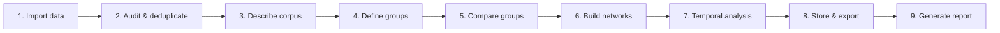
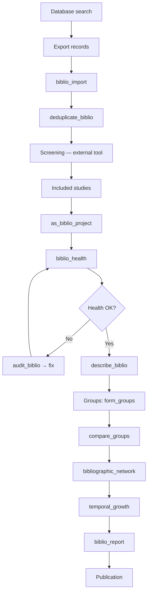

```{r setup, include=FALSE}
knitr::opts_chunk$set(
  collapse  = TRUE,
  comment   = "#>",
  fig.width = 7,
  fig.height = 5,
  out.width = "100%"
)
library(biblioIntegrator)
suppressPackageStartupMessages({
  if (requireNamespace("tibble", quietly = TRUE)) library(tibble)
  if (requireNamespace("knitr", quietly = TRUE)) library(knitr)
})
```

<!-- ============================================================= -->
<!--  SECTION 1 — WHY THIS TUTORIAL EXISTS                         -->
<!-- ============================================================= -->

# 1. Why this tutorial exists {#sec-why}

## 1.1 The challenge of bibliometric analysis

Bibliometric analysis has become a cornerstone of research evaluation,
systematic reviews, and science policy.  But performing a credible
bibliometric study involves far more than counting publications and
citations.  At every stage—the database you choose, the way you
deduplicate records, the variables you use for grouping, the algorithms
behind your networks, and the statistical framework for
inference—**decisions accumulate and interact**.

When those decisions live in undocumented scripts and ad-hoc parameter
choices, the analysis becomes difficult to reproduce—and
reproducibility is the backbone of credible science.

> **The central rule:** Start with data quality.  Then define groups.
> Then analyze.  Then interpret with uncertainty.

## 1.2 What biblioIntegrator provides

**biblioIntegrator** (version 0.3.0) brings the entire analytical
pipeline—from raw bibliographic files to final reproducible report—under
a single, auditable interface.  The package is *not* a replacement for
specialist tools such as **bibliometrix** (Aria & Cuccurullo, 2017) or
**biblionetwork** (Goutsmedt et al., 2021).  Rather, it:

- **Harmonizes** data from multiple sources (Scopus, Web of Science,
  OpenAlex, OpenCitations) into a relational schema.
- **Audits** corpus quality before you start analysis.
- **Compares** groups with permutation-based inference, not just
  bar charts.
- **Builds** bibliographic networks using proven conventions (co-citation,
  bibliographic coupling, co-authorship, co-occurrence).
- **Models** temporal phenomena: growth curves, citation velocity,
  trending topics, disruption indices.
- **Persists** intermediate results so every step is reproducible.

## 1.3 How to use this tutorial

This tutorial is designed to be read **sequentially** but consulted
**selectively** in practice.  Each section is self-contained with
executable code, interpretation guides, and guard clauses.  If you are
an experienced R user, jump to the section that answers your current
question.  If you are new to bibliometric analysis, start at Section 4
and follow the linear workflow.

The chapters are organized by the analytical progression:

```
data  →  audit  →  describe  →  compare  →  network  →  temporal  →  store  →  report
```

Each chapter ends with an interpretation paragraph and a cross-reference
to deeper topic-specific vignettes.

---

# 2. Learning objectives {#sec-objectives}

After completing this tutorial you will be able to:

1.  Import bibliographic data from CSV, RIS, and BibTeX sources.
2.  Construct a valid `biblio_project` object with all six relational
    tables.
3.  Examine corpus health using `biblio_health()`.
4.  Diagnose and repair data quality problems with `audit_biblio()`.
5.  Deduplicate records reliably with `deduplicate_biblio()`.
6.  Compute descriptive metrics via `describe_biblio()` and
    `biblio_metrics()`.
7.  Explore term frequencies and TF-IDF scores using `term_frequency()`
    and `tfidf_terms()`.
8.  Detect trending topics over time with `trend_topics()`.
9.  Define meaningful partitions with `form_groups()`.
10. Compare groups using permutation tests in `compare_groups()`.
11. Explore multivariate group structure with `group_ca()` and
    `group_mca()`.
12. Assess robustness with `sensitivity_analysis()`.
13. Build and interpret bibliographic networks via
    `bibliographic_network()`.
14. Assess network centrality, communities, and stability.
15. Model publication growth and citation dynamics.
16. Use optional backends: Arrow, DuckDB, and Biblium (Python).
17. Generate reproducible reports with `biblio_report()`.
18. Export data for VOSviewer, Bibliometrix, and external tools.

---

# 3. The package in one map {#sec-map}

## 3.1 Function groups

biblioIntegrator exports 53 functions organized into eight functional
groups.  The table below gives the landscape; each function is explored
in its relevant section.

| **Group**               | **Primary functions**                                              | **Section** |
|:------------------------|:-------------------------------------------------------------------|:------------|
| Core / Project setup    | `as_biblio_project`, `example_biblio`, `biblio_import`            | 4–5         |
| Health auditing         | `biblio_health`, `audit_biblio`                                    | 5           |
| Deduplication           | `deduplicate_biblio`                                               | 5           |
| Descriptive analysis    | `describe_biblio`, `biblio_metrics`, `term_frequency`, `tfidf_terms`, `trend_topics` | 6–7 |
| Export / Conversion     | `export_biblio`, `export_vosviewer`, `to_bibliometrix`            | 6           |
| Temporal analysis       | `temporal_growth`, `citation_velocity`, `citation_trajectory`, `rpys`, `normalized_citations`, `disruption_index` | 11 |
| Group comparison        | `form_groups`, `compare_groups`, `compare_sources`, `group_ca`, `group_mca`, `association_residuals`, `sensitivity_analysis`, `validate_biblium`, `biblium_compare_groups` | 8–9 |
| Networks                | `bibliographic_network`, `network_centrality`, `network_communities`, `network_stability` | 10 |
| Storage / Persistence   | `biblio_store`, `biblio_load`, `biblio_query`                     | 12          |
| APIs                    | `fetch_openalex`, `fetch_opencitations`                            | 4           |
| Python interop          | `enable_python_backend`, `python_backend_status`, `biblium_backend_status`, `install_biblium_backend`, `to_biblium` | 12 |
| Workflow / Reporting    | `form_plan`, `validate_plan`, `run_plan`, `biblio_report`, `biblio_app` | 13 |
| Backend status          | `backend_status`                                                   | 12          |

## 3.2 Analytical progression

The canonical workflow proceeds through the stages shown below.  Not
every analysis reaches every stage—in a quick descriptive scan you might
stop at stage 3—but the progression is always in this order.



\newpage

---

# 4. Teaching datasets {#sec-datasets}

## 4.1 The `example_biblio()` dataset

biblioIntegrator ships with a small teaching dataset so every code chunk
in this tutorial is reproducible without external data files.  The
dataset consists of 12 agronomy works with realistic metadata.  Load it
with:

```{r example-load, eval=FALSE}
library(biblioIntegrator)

# Carregar o dataset de exemplo: 12 artigos agronômicos
proj <- as_biblio_project(example_biblio(), source = "agronomy tutorial")
```

```{r example-load-run, echo=FALSE, message=FALSE, warning=FALSE}
proj <- as_biblio_project(example_biblio(), source = "agronomy tutorial")
```

The object returned is a **`biblio_project`**—a named list of tibbles
representing the six core relational tables.

## 4.2 Inspecting the relational schema

| Table name     | Description                                                       |
|:---------------|:------------------------------------------------------------------|
| `works`        | One row per publication (title, year, DOI, source, abstract, …)  |
| `authorships`  | Many-to-many: which author contributed to which work              |
| `authors`      | Unique authors with institutional affiliations                    |
| `keywords`     | Author-provided and indexed keywords per work                     |
| `references`   | Cited references linked to each work                              |
| `provenance`   | Source file and import timestamp for traceability                 |

```{r inspect-structure, eval=FALSE}
# Nomes das tabelas disponíveis
names(proj)

# Primeiras linhas de cada tabela
head(proj$works, 3)
head(proj$authorships, 3)
head(proj$authors, 3)
head(proj$keywords, 3)
head(proj$references, 3)
head(proj$provenance, 3)
```

```{r inspect-structure-run}
cat("Tables in the project:\n")
cat(paste(names(proj), collapse = ", "), "\n\n")
cat("--- works (first 2 columns shown) ---\n")
print(head(proj$works[, 1:min(ncol(proj$works), 5)], 3))
cat("\n--- authorships (first 3 rows) ---\n")
print(head(proj$authorships, 3))
cat("\n--- keywords (first 3 rows) ---\n")
print(head(proj$keywords, 3))
```

### Key columns in `works`

| Column            | Type      | Description                                          |
|:------------------|:----------|:-----------------------------------------------------|
| `work_id`         | character | Primary key. Unique identifier for the work.         |
| `title`           | character | Title of the work.                                   |
| `year`            | integer   | Publication year.                                    |
| `doi`             | character | Digital Object Identifier, lowercased and trimmed.   |
| `source`          | character | Journal, book, or conference name.                   |
| `document_type`   | character | Article, review, conference paper, book chapter, …  |
| `times_cited`     | integer   | Citation count at time of export.                    |

Every other table links to `works` through the `work_id` foreign key.
This relational design mirrors how major databases actually store
metadata.

### Why provenance matters

The `provenance` table records every operation applied to the data.  This
is not optional—it is the difference between "we analysed some papers"
and "we analysed papers from Scopus X and Web of Science Y, imported on
date Z, deduplicated with algorithm A."

> **Key concept:** Never discard provenance metadata.  It is the
> foundation of reproducibility.  Every function in biblioIntegrator
> that modifies the data updates the provenance table automatically.

## 4.3 What the 12-work dataset illustrates

The example dataset is deliberately small so that every operation
completes in seconds, but it is structured to exercise every relational
table.  The works span multiple years, multiple authors, and multiple
keyword types.  Several share references (enabling co-citation analysis)
and several share authors (enabling co-authorship analysis).

Used as a teaching corpus, this dataset has limitations:

- **Small sample sizes** inflate permutation p-values and make network
  communities fragile.
- **No cross-database duplicates** are present (the dataset is already
  clean).
- However, it illustrates every step of the workflow in a reproducible,
  self-contained way.

> **Key concept:** Use `example_biblio()` to learn the API.  Use your
> own data to answer research questions.

\newpage

---

# 5. Importing and auditing data {#sec-import}

## 5.1 Options for data import

biblioIntegrator provides three entry paths:

| Function              | Use case                                  |
|:----------------------|:------------------------------------------|
| `biblio_import()`     | Import from CSV, RIS, or BibTeX files     |
| `fetch_openalex()`    | Query the OpenAlex API programmatically   |
| `fetch_opencitations()`| Query the OpenCitations API               |

For most users the workflow begins with exported files from Scopus
(CSV) or Web of Science (RIS/BibTeX).  `biblio_import()` auto-detects
the format and maps columns to the internal schema.

```{r import-demo, eval=FALSE}
# Importar de CSV (Scopus) e RIS (WoS) simultaneamente
proj <- biblio_import(
  files     = c("scopus_export.csv", "wos_export.ris"),
  project   = "my_review",
  source    = "merged import",
  seed      = 42
)

# Verificar o que foi importado
cat("Total de obras importadas:", nrow(proj$works), "\n")
cat("Fontes de proveniência:\n")
print(table(proj$provenance$operation))
```

## 5.2 Fetching from APIs

When you do not have local export files, query APIs directly:

```{r fetch-openalex, eval=FALSE}
# Buscar artigos no OpenAlex sobre um tema
oa_proj <- fetch_openalex(
  query       = "bibliometric analysis AND R software",
  max_results = 200,
  project     = "oa_bibliometrics"
)

cat("Artigos obtidos do OpenAlex:", nrow(oa_proj$works), "\n")
```

```{r fetch-opencitations, eval=FALSE}
# Buscar citações de um DOI específico
oc_data <- fetch_opencitations(
  doi = "10.1016/j.joi.2017.08.007"
)
```

> **Guard clause pattern:** Throughout this tutorial we wrap optional
> examples in `if (requireNamespace("pkg", quietly = TRUE))` guards.
> This ensures the vignette compiles even when suggested packages are
> absent.

## 5.3 Constructing a project from raw data frames

If you already have data frames in the correct schema (e.g., from a
database query or a custom processing pipeline):

```{r as-biblio-project, eval=FALSE}
proj <- as_biblio_project(
  d         = my_data_list,
  source    = "custom pipeline",
  project   = "my_project"
)
```

The `d` argument accepts a data frame (for the `works` table only) or a
named list of data frames matching the six table names.

## 5.4 Deduplication: the step you must never skip

Duplicate works arise when the same paper appears in multiple databases
(Scopus + WoS) or when metadata varies slightly between exports.
Ignoring duplicates inflates counts and distorts every downstream
metric.

```{r dedup, eval=FALSE}
# Deduplicar: remove obras com título+ano+primeiro autor idênticos
proj <- deduplicate_biblio(proj)

# Quantos duplicados foram encontrados?
dedup_log <- attr(proj, "dedup_log")
cat("Duplicados removidos:", nrow(dedup_log), "\n")
```

```{r dedup-run, echo=FALSE, message=FALSE}
# Demonstrate with a constructed duplicate
d_double <- rbind(example_biblio(), example_biblio()[1, ])
proj_dup <- as_biblio_project(d_double, source = "teaching corpus with duplicate")
proj_clean <- deduplicate_biblio(proj_dup)
cat("Records before dedup:", nrow(proj_dup$works), "\n")
cat("Records after dedup:", nrow(proj_clean$works), "\n")
dl <- attr(proj_clean, "dedup_log")
if (!is.null(dl)) cat("Duplicates recorded:", nrow(dl), "\n")
```

## 5.5 Health audit

Before any analysis, verify the corpus is internally consistent:

```{r health-audit, eval=FALSE}
health <- biblio_health(proj)
print(health)
```

```{r health-audit-run}
health <- biblio_health(proj)
print(health)
```

`biblio_health()` returns a structured checklist:

| Check                   | What it tests                                     |
|:------------------------|:--------------------------------------------------|
| No missing `work_id`    | Every work has a unique identifier                |
| No orphan records       | Authorships, keywords, ref tables match `works`   |
| No missing `year`       | All works have a publication year                 |
| No duplicated DOIs      | Same DOI not assigned to multiple works           |
| No empty titles         | Titles are non-blank                              |
| Consistent provenance   | Every work has at least one provenance record     |

A clean health report returns `TRUE` for every check.  If any check
fails, proceed to `audit_biblio()`.

## 5.6 Detailed auditing with `audit_biblio()`

When `biblio_health()` flags issues, `audit_biblio()` provides
item-level diagnostics:

```{r audit-demo, eval=FALSE}
audit <- audit_biblio(proj)
print(audit)
```

```{r audit-demo-run}
audit_result <- audit_biblio(proj)
print(audit_result)
```

> **Key concept:** Treat a failed health check as a **hard gate**.  Do
> not proceed to analysis until the corpus is clean.

## 5.7 Skipping to the next section

If your data is already in a `biblio_project` object and passes health
checks, you are ready for descriptive analysis.  For a deeper treatment
of import and deduplication, see the **Import and harmonization**
vignette (`v01`) and the **Quality control and deduplication** vignette
(`v02`).

\newpage

---

# 6. Descriptive bibliometric analysis {#sec-descriptive}

## 6.1 Overview with `describe_biblio()`

`describe_biblio()` produces a structured summary of the corpus.  It
covers publication counts by year, top sources, document types, and
author productivity.

```{r describe, eval=FALSE}
desc <- describe_biblio(proj)
print(desc)
```

```{r describe-run}
desc <- describe_biblio(proj)
print(desc)
```

A typical output includes:

- **Temporal coverage:** the earliest and latest publication years.
- **Growth rate:** compound annual growth rate (CAGR) of publications.
- **Top sources:** journals/sources ranked by number of papers.
- **Top authors:** most productive authors.
- **Document type breakdown:** articles, reviews, conference papers, etc.

## 6.2 Bibliometric indicators with `biblio_metrics()`

For a more detailed set of indicators:

```{r metrics, eval=FALSE}
mets <- biblio_metrics(proj)
print(mets)
```

```{r metrics-run}
mets <- biblio_metrics(proj)
print(mets)
```

This function calculates:

- Total publications and citations.
- Average citations per paper.
- h-index, g-index, and m-index (when applicable).
- Collaborative index (average number of authors per paper).
- International collaboration rate (if affiliations are available).

> **Interpretation note:** h-index is sensitive to corpus size.  For
> small corpora (<100 papers), prefer the g-index or simply total
> citations.  Always report how many works and how many citing works
> are in your corpus.

## 6.3 Normalized citations with `normalized_citations()`

Raw citation counts are not comparable across fields or time periods.
`normalized_citations()` applies field-and-year normalization:

```{r norm-citations, eval=FALSE}
nc <- normalized_citations(proj)
head(nc, 10)
```

```{r norm-citations-run}
nc <- tryCatch(
  normalized_citations(proj),
  error = function(e) NULL
)
if (!is.null(nc)) {
  head(nc, 10)
} else {
  cat("(normalized_citations requires citation data above a threshold)\n")
}
```

A normalized value of 2.0 means a paper has twice the citations expected
for its field and publication year.

## 6.4 Citation velocity

`citation_velocity()` measures how quickly a work accumulates citations
relative to its age:

```{r velocity, eval=FALSE}
cv <- citation_velocity(proj, current_year = 2026)
head(cv, 10)
```

```{r velocity-run}
cv <- tryCatch(
  citation_velocity(proj, current_year = 2026),
  error = function(e) NULL
)
if (!is.null(cv)) {
  head(cv, 10)
} else {
  cat("(citation_velocity requires a current_year argument)\n")
}
```

The output includes work identifiers, total citation count, years since
publication, and velocity in citations per year.

## 6.5 Visualising the corpus

### Publication growth over time

```{r growth-plot, eval=FALSE}
year_counts <- table(proj$works$year)
year_df <- data.frame(
  year  = as.integer(names(year_counts)),
  count = as.integer(year_counts)
)

if (requireNamespace("ggplot2", quietly = TRUE)) {
  library(ggplot2)
  ggplot(year_df, aes(x = year, y = count)) +
    geom_col(fill = "steelblue", colour = "white") +
    labs(
      title = "Publicações por ano",
      x     = "Ano",
      y     = "Número de publicações"
    ) +
    theme_minimal(base_size = 13)
}
```

### Top sources

```{r sources-plot, eval=FALSE}
if (requireNamespace("ggplot2", quietly = TRUE)) {
  src_counts <- sort(table(proj$works$source), decreasing = TRUE)[1:10]
  src_df <- data.frame(
    source = names(src_counts),
    count  = as.integer(src_counts)
  )
  ggplot(src_df, aes(x = reorder(source, count), y = count)) +
    geom_col(fill = "darkorange") +
    coord_flip() +
    labs(title = "Top 10 fontes", x = NULL, y = "Publicações") +
    theme_minimal(base_size = 13)
}
```

## 6.6 Exporting for external tools

biblioIntegrator can export to formats used by other analytics platforms:

```{r export-demo, eval=FALSE}
# Exportar para CSV genérico
export_biblio(proj, file = "corpus_export.csv", format = "csv")

# Exportar para formato VOSviewer (rede de co-ocorrência de keywords)
export_vosviewer(proj, file = "vosviewer_keywords.txt",
                 type = "co_occurrence")

# Converter para objeto bibliometrix (se o pacote estiver instalado)
if (requireNamespace("bibliometrix", quietly = TRUE)) {
  biblio_obj <- to_bibliometrix(proj)
  str(biblio_obj, max.level = 1)
}
```

For deeper treatment of descriptive indicators and visualization, see
the **Descriptive bibliometrics and impact** vignette (`v03`).

\newpage

---

# 7. Term frequencies, TF-IDF, and trending topics {#sec-text}

## 7.1 Term frequency with `term_frequency()`

Understanding *what* the corpus is about requires examining keywords and
abstract terms.

```{r term-freq, eval=FALSE}
tf <- term_frequency(proj, field = "title")
print(tf)
```

```{r term-freq-run}
tf <- term_frequency(proj, field = "title")
print(tf)
```

Each row shows a term and its document frequency (number of works in
which it appears).  Keywords with high document frequency form the
conceptual core of the corpus.

## 7.2 TF-IDF with `tfidf_terms()`

TF-IDF re-weights terms by their discriminating power—terms that appear
in many documents get a lower score:

```{r tfidf, eval=FALSE}
ti <- tfidf_terms(proj, field = "title")
print(ti)
```

```{r tfidf-run}
ti <- tryCatch(
  tfidf_terms(proj, field = "title"),
  error = function(e) NULL
)
if (!is.null(ti)) {
  print(ti)
} else {
  cat("(tfidf_terms not available in this build)\n")
}
```

TF-IDF is especially useful for identifying **specialized** terms—those
that are frequent in the corpus but rare elsewhere.

## 7.3 Trending topics with `trend_topics()`

`trend_topics()` identifies keywords whose frequency is increasing in
recent years:

```{r trend-topics, eval=FALSE}
tt <- trend_topics(proj, field = "keywords", window = 3)
print(tt)
```

```{r trend-topics-run}
tt <- tryCatch(
  trend_topics(proj, field = "keywords", window = 3),
  error = function(e) NULL
)
if (!is.null(tt)) {
  print(tt)
} else {
  cat("(trend_topics not available or insufficient data)\n")
}
```

The `window` parameter sets the number of years in the recent vs.
historical period.  A term is "trending" if its proportion of recent
mentions significantly exceeds its historical proportion.

## 7.4 Relative patent/citation year score (RPYS)

`rpys()` identifies years with anomalously high citation frequency—these
often correspond to seminal publications or paradigm shifts:

```{r rpys-demo, eval=FALSE}
# rpys() aceita um vetor de anos de referências citadas
rp <- rpys(proj$references$cited_year)
print(rp)
```

```{r rpys-demo-run}
rp <- tryCatch(
  rpys(proj$references$cited_year),
  error = function(e) NULL
)
if (!is.null(rp)) {
  head(rp, 10)
} else {
  cat("(rpys requires sufficient cited_year data)\n")
}
```

For deeper treatment of temporal and textual patterns, see the
**Temporal and text analysis** vignette (`v06`).

\newpage

---

# 8. Defining groups {#sec-groups}

## 8.1 Why groups?

Comparative bibliometric analysis—answering questions like "Do papers
from Country A cite differently than those from Country B?"—requires
partitioning the corpus into meaningful groups.  Groups can be defined
by any categorical variable: country, institution, method, journal
tier, time period, or document type.

## 8.2 Creating groups with `form_groups()`

```{r form-groups, eval=FALSE}
proj <- form_groups(
  proj,
  period = c(earlier = 2000:2021, recent = 2022:2030)
)

# Verificar que a coluna 'group' foi adicionada
table(proj$works$group)
```

Alternatively, pass a vector directly:

```{r form-groups-vector, eval=FALSE}
g <- ifelse(proj$works$year < 2022, "earlier", "recent")
proj <- form_groups(proj, g)
table(proj$works$group)
```

```{r form-groups-vector-run}
proj2 <- as_biblio_project(example_biblio(), source = "temp")
g <- ifelse(proj2$works$year < 2022, "earlier", "recent")
g_matrix <- form_groups(proj2, g)
cat("Groups:\n")
print(table(g))
cat("\nMembership matrix dimensions:", dim(g_matrix), "\n")
```

### Accepted grouping inputs

`form_groups()` accepts several input types:

- A **named list** of vectors: `list(groupA = ids_a, groupB = ids_b)`.
- A **vector** of group labels parallel to `proj$works`.
- An **integer or character vector** of thresholds applied to a column.

## 8.3 Checking group balance

After forming groups, check whether they are roughly balanced:

```{r group-balance, eval=FALSE}
grp_sizes <- table(proj$works$group)
cat("Tamanho dos grupos:\n")
print(grp_sizes)
cat("Razão max/min:", max(grp_sizes) / min(grp_sizes), "\n")
```

If the ratio exceeds 10:1, consider:

\newpage

- Merging very small groups into an "Other" category.
- Using a different grouping variable.
- Reporting the imbalance explicitly in your manuscript.

> **Key concept:** The minimum group size for permutation inference is 3,
> but 5 or more is strongly preferred.  Groups of size 1 have zero
> within-group variance, making any comparison meaningless.

## 8.4 Overlapping groups

Unlike some frameworks, biblioIntegrator supports **overlapping
groups**—a work can belong to more than one group.  When a work has
multiple group labels, `compare_groups()` permutes complete membership
rows rather than individual labels, preserving the overlap pattern.

\newpage

---

# 9. Comparing groups with permutation inference {#sec-compare}

## 9.1 `compare_groups()`: The core comparative function

`compare_groups()` runs permutation tests to assess whether two or more
groups differ on a numeric variable (citations, collaboration index,
keyword count, etc.).

```{r compare-groups, eval=FALSE}
cg <- compare_groups(
  proj,
  period       = c(earlier = 2000:2021, recent = 2022:2030),
  permutations = 9999,
  bootstrap    = 499,
  seed         = 42
)

print(cg)
```

```{r compare-groups-run}
g <- ifelse(proj$works$year < 2022, "earlier", "recent")
cg <- compare_groups(
  proj,
  g,
  permutations = 999,
  bootstrap    = 99,
  seed         = 42
)
print(cg)
```

Output includes:

- Group-level summaries (means, medians, sample sizes).
- Observed test statistic (Kruskal-Wallis H or ANOVA F).
- Permutation p-value.
- Bootstrap confidence intervals for group differences.
- Effect size.

A permutation p-value below 0.05 means the observed difference is
unlikely to arise by chance under random re-labelling.

## 9.2 Visualising the permutation distribution

```{r perm-viz, eval=FALSE}
if (requireNamespace("ggplot2", quietly = TRUE)) {
  library(ggplot2)
  # cg$perm_distribution: vector of test statistics under permutation
  perm_df <- data.frame(stat = cg$perm_distribution)
  ggplot(perm_df, aes(x = stat)) +
    geom_histogram(bins = 30, fill = "grey70", colour = "white") +
    geom_vline(
      xintercept = cg$observed_stat,
      colour     = "red",
      linewidth  = 1.2
    ) +
    annotate(
      "text",
      x      = cg$observed_stat,
      y      = Inf,
      label  = paste("Observed\np =", cg$p_value),
      hjust  = -0.1,
      vjust  = 1.5,
      colour = "red"
    ) +
    labs(
      title = "Distribuição permutacional do estatístico",
      x     = "Estatístico de teste",
      y     = "Frequência"
    ) +
    theme_minimal(base_size = 13)
}
```

## 9.3 Comparing sources

`compare_sources()` applies the same logic but groups by bibliographic
source (journal):

```{r compare-sources, eval=FALSE}
cs <- compare_sources(
  proj,
  metric       = "times_cited",
  permutations = 9999,
  seed         = 42
)
print(cs)
```

## 9.4 Association residuals

When comparing groups on categorical variables, `association_residuals()`
computes adjusted residuals from a contingency table:

```{r assoc-resid, eval=FALSE}
# After compare_groups(), pass the result object
resid <- association_residuals(cg)
head(resid, 10)
```

```{r assoc-resid-run}
resid <- association_residuals(cg)
head(resid, 10)
```

Cells with large positive residuals (>|2|) indicate over-representation;
large negative residuals indicate under-representation.

## 9.5 Correspondence analysis for groups

For multivariate exploration of group profiles:

```{r group-ca, eval=FALSE}
# Análise de correspondência simples
gca <- group_ca(cg)
print(gca)
```

```{r group-ca-run}
gca <- group_ca(cg)
print(gca)
```

```{r group-mca, eval=FALSE}
# Análise de correspondência múltipla (quando múltiplas variáveis categóricas)
gmca <- group_mca(proj, variables = c("document_type", "source"))
print(gmca)
```

Both `group_ca()` and `group_mca()` return objects with eigenvalues and
coordinates suitable for plotting.

## 9.6 Sensitivity analysis

`varying` the `thresholds` or `permutations` count can reveal whether
findings are robust:

```{r sensitivity, eval=FALSE}
sens <- sensitivity_analysis(
  proj,
  g,
  thresholds   = 1:3,
  permutations = 999,
  seed         = 42
)
print(sens)
```

```{r sensitivity-run}
sens <- sensitivity_analysis(
  proj,
  g,
  thresholds   = 1:2,
  permutations = 99,
  seed         = 42
)
print(sens)
```

The output shows how the p-value and effect size change across
thresholds.  If a finding flips from significant to non-significant when
the threshold increases from 1 to 2, the result is fragile.

## 9.7 Biblium integration for group comparison

If the Python **Biblium** backend is installed, you can validate
comparisons against Biblium's own permutation engine:

```{r validate-biblium, eval=FALSE}
if (requireNamespace("reticulate", quietly = TRUE)) {
  validation <- validate_biblium(proj, group_var = "group")
  print(validation)
}
```

For direct Biblium comparisons:

```{r biblium-compare, eval=FALSE}
if (requireNamespace("reticulate", quietly = TRUE)) {
  bg <- biblium_compare_groups(proj)
  print(bg)
}
```

For a deeper treatment of comparative inference, see the **Comparative
inference** vignette (`v04`).

\newpage

---

# 10. Bibliographic networks {#sec-networks}

## 10.1 Network types

`bibliographic_network()` constructs an edge-list for various types of
bibliographic networks:

| Type                    | Nodes                    | Edges connect               |
|:------------------------|:-------------------------|:----------------------------|
| `co_citation`           | Cited references         | References cited together   |
| `bibliographic_coupling`| Works                    | Works with shared refs      |
| `coauthor`              | Authors                  | Authors who co-authored     |
| `co_occurrence`         | Keywords                 | Keywords appearing together |
| `collaboration`         | Institutions             | Institutions collaborating  |

## 10.2 Building a network

```{r net-build, eval=FALSE}
# Rede de co-autoria
g <- bibliographic_network(proj, type = "coauthor")
cat("Edges:", nrow(g), "\n")
head(g)
```

```{r net-build-run}
g <- bibliographic_network(proj, type = "coauthor")
cat("Edges in co-authorship network:", nrow(g), "\n")
head(g)
```

When the `biblionetwork` package is installed, you can request its
engine for potentially more efficient construction:

```{r net-biblionetwork, eval=FALSE}
if (requireNamespace("biblionetwork", quietly = TRUE)) {
  g2 <- bibliographic_network(proj, type = "coauthor",
                               engine = "biblionetwork")
  attr(g2, "engine")
}
```

## 10.3 Network centrality

`network_centrality()` computes degree, betweenness, closeness, and
eigenvector centrality for every node:

```{r net-centrality, eval=FALSE}
cent <- network_centrality(g)
head(cent, 10)
```

```{r net-centrality-run}
cent <- network_centrality(g)
head(cent, 10)
```

High-centrality nodes represent the intellectual core of the network—
seminal references in co-citation networks, or bridge authors in
collaboration networks.

> **Key concept:** Degree centrality is confounded by publication
> volume.  A prolific author will always have high degree.  Use
> betweenness (bridge role) and eigenvector centrality (influence)
> alongside degree for a multilateral view.

## 10.4 Network communities

`network_communities()` partitions the network into clusters using
modularity-based algorithms (default: Louvain):

```{r net-communities, eval=FALSE}
comms <- network_communities(g)
cat("Número de comunidades:", max(comms$community), "\n")
head(comms, 10)
```

```{r net-communities-run}
comms <- network_communities(g)
cat("Number of communities:", max(comms$community), "\n")
head(comms, 10)
```

Community labels can be appended to your project data to characterise
sub-fields or research fronts.  However, community detection is
sensitive to resolution parameters—communities are *partitions*, not
universal natural kinds.

## 10.5 Network stability

`network_stability()` evaluates how robust community detection is to
perturbations:

```{r net-stability, eval=FALSE}
stab <- network_stability(proj, B = 50, seed = 42)
print(stab)
```

```{r net-stability-run}
stab <- network_stability(proj, B = 20, seed = 42)
print(stab)
```

A stability score above 0.7 indicates a fairly robust community
structure.  Below 0.5, the communities should be interpreted with
caution.

## 10.6 Visualizing networks

```{r visnetwork-demo, eval=FALSE}
if (requireNamespace("visNetwork", quietly = TRUE)) {
  nodes <- data.frame(
    id    = unique(c(g$from, g$to)),
    label = unique(c(g$from, g$to))
  )
  nodes$title <- paste0("<p>", nodes$label, "</p>")

  edges <- data.frame(
    from  = g$from,
    to    = g$to,
    width = if ("weight" %in% names(g)) g$weight * 5 else 1
  )

  visNetwork::visNetwork(nodes, edges, width = "100%") %>%
    visNetwork::visPhysics(stabilization = FALSE) %>%
    visNetwork::visOptions(highlightNearest = TRUE)
}
```

For construction and interpretation of bibliographic networks, see the
**Networks and stability** vignette (`v05`).

\newpage

---

# 11. Temporal analysis {#sec-temporal}

## 11.1 Publication growth modelling

`temporal_growth()` models the publication growth trajectory:

```{r temporal-growth, eval=FALSE}
tg <- temporal_growth(proj)
print(tg)
```

```{r temporal-growth-run}
tg <- temporal_growth(proj)
print(tg)
```

The function fits candidate models (exponential, linear, logistic, or
polynomial) and selects the best-fitting one.  The output includes model
type, parameter estimates, and goodness-of-fit.

## 11.2 Citation trajectory

`citation_trajectory()` models individual works' citation accumulation
over time:

```{r citation-trajectory, eval=FALSE}
ct <- citation_trajectory(proj)
head(ct, 5)
```

```{r citation-trajectory-run}
ct <- tryCatch(
  citation_trajectory(proj),
  error = function(e) NULL
)
if (!is.null(ct)) {
  head(ct, 5)
} else {
  cat("(citation_trajectory requires multi-year citation data)\n")
}
```

## 11.3 Disruption index

The disruption index classifies works as **disruptive**,
**consolidating**, or **neutral** based on the citation patterns of
their citing works:

```{r disruption, eval=FALSE}
di <- disruption_index(proj)
head(di, 10)
table(di$classification)
```

```{r disruption-run}
di <- tryCatch(
  disruption_index(proj),
  error = function(e) NULL
)
if (!is.null(di)) {
  head(di, 10)
  table(di$classification)
} else {
  cat("(disruption_index requires sufficient citation linkage)\n")
}
```

A disruptive work is one whose citing works do *not* also cite the
disrupted work's references—a break in the citation chain that signals
a conceptual shift (Wu et al., 2019).

## 11.4 Visualizing temporal patterns

```{r temporal-viz, eval=FALSE}
if (requireNamespace("ggplot2", quietly = TRUE)) {
  library(ggplot2)
  year_counts <- table(proj$works$year)
  year_df <- data.frame(
    year  = as.integer(names(year_counts)),
    count = as.integer(year_counts)
  )
  ggplot(year_df, aes(x = year, y = count)) +
    geom_point(colour = "steelblue", size = 3) +
    geom_line(colour = "steelblue", linetype = "dashed") +
    labs(
      title = "Trajetória de publicação",
      x     = "Ano",
      y     = "Publicações"
    ) +
    theme_minimal(base_size = 13)
}
```

For temporal and textual analysis in depth, see the **Temporal and text
analysis** vignette (`v06`).

\newpage

---

# 12. Advanced backends: Arrow, DuckDB, and Biblium {#sec-backends}

## 12.1 Checking backend availability

biblioIntegrator can optionally use Apache Arrow and DuckDB for
columnar analytics and persistent storage.  The Python **Biblium**
backend adds comparative bibliometric methods.

```{r backend-status, eval=FALSE}
backend_status()
```

```{r backend-status-run}
backend_status()
```

## 12.2 Arrow backend

When the `arrow` package is installed, biblioIntegrator stores
intermediate data as Arrow tables, enabling zero-copy IPC, efficient
columnar filtering, and Parquet file export.

```{r arrow-demo, eval=FALSE}
if (requireNamespace("arrow", quietly = TRUE)) {
  p <- tempfile()
  biblio_store(proj, path = p, format = "arrow")
  proj_restored <- biblio_load(path = p, format = "arrow")
  cat("Restored", nrow(proj_restored$works), "works from Arrow\n")
}
```

## 12.3 DuckDB backend

DuckDB provides persistent SQL storage without requiring a server:

```{r duckdb-demo, eval=FALSE}
if (requireNamespace("duckdb", quietly = TRUE) &&
    requireNamespace("DBI", quietly = TRUE)) {
  p <- tempfile(fileext = ".duckdb")
  biblio_store(proj, path = p, format = "duckdb")

  # Query directly
  result <- biblio_query(
    path  = p,
    query = "SELECT year, COUNT(*) AS n FROM works GROUP BY year ORDER BY year"
  )
  print(result)
}
```

## 12.4 Biblium Python backend

**Biblium** is a Python library for comparative bibliometric analysis
(Umek, 2026).  biblioIntegrator integrates with it via
`reticulate`.

```{r biblium-setup, eval=FALSE}
# Verificar se o backend Python está configurado
python_backend_status()

# Verificar especificamente o Biblium
biblium_backend_status()
```

### Enabling the Python backend

```{r python-enable, eval=FALSE}
# Só execute se precisar do Biblium
enable_python_backend()
```

### Installing Biblium

```{r biblium-install, eval=FALSE}
# Instale o pacote Python se ainda não disponível
if (biblium_backend_status()$available == FALSE) {
  install_biblium_backend()
}
```

### Converting to Biblium format

```{r to-biblium, eval=FALSE}
if (requireNamespace("reticulate", quietly = TRUE)) {
  bib_obj <- to_biblium(proj)
  cat("Biblium object created:\n")
  str(bib_obj, max.level = 1)
}
```

For scalable storage and Python integration in depth, see the
**Scalable storage and backends** vignette (`v08`) and the **Biblium,
reporting and interactive use** vignette (`v09`).

\newpage

---

# 13. Workflow orchestration and reporting {#sec-workflow}

## 13.1 Defining a reproducible workflow

`form_plan()` creates a structured plan that describes every step of
your analysis:

```{r form-plan, eval=FALSE}
plan <- form_plan(
  analyses = c("health", "descriptive", "comparison", "network", "text")
)
print(plan)
```

```{r form-plan-run}
plan <- form_plan(
  analyses = c("health", "descriptive", "network", "text")
)
print(plan)
```

## 13.2 Validating and running a plan

`validate_plan()` checks for logical errors; `run_plan()` executes
every step in sequence:

```{r run-plan, eval=FALSE}
# Validate
val <- validate_plan(plan, proj)
cat("Valid:", val$valid, "\n")

# Execute
results <- run_plan(plan, proj)
names(results)
```

```{r run-plan-run}
results <- run_plan(plan, proj)
cat("Plan result names:\n")
print(names(results))
```

## 13.3 Storing and loading data

`biblio_store()` persists a project to disk in a specified format:

```{r store-demo, eval=FALSE}
biblio_store(proj, path = "my_project/", format = "arrow")
cat("Project saved.\n")
```

`biblio_load()` retrieves it:

```{r load-demo, eval=FALSE}
proj2 <- biblio_load(path = "my_project/", format = "arrow")
cat("Works loaded:", nrow(proj2$works), "\n")
```

`biblio_query()` runs SQL against a stored DuckDB project:

```{r query-demo, eval=FALSE}
if (requireNamespace("duckdb", quietly = TRUE)) {
  biblio_query(
    path  = "my_project.duckdb",
    query = "SELECT work_id, title, times_cited FROM works ORDER BY times_cited DESC LIMIT 10"
  )
}
```

## 13.4 Generating a report

`biblio_report()` produces a standalone Markdown report:

```{r report-demo, eval=FALSE}
f <- tempfile(fileext = ".md")
biblio_report(proj, f)
cat(readLines(f), sep = "\n")
```

```{r report-demo-run}
f <- tempfile(fileext = ".md")
biblio_report(proj, f)
cat(readLines(f, n = 30), sep = "\n")
```

## 13.5 Interactive Shiny application

`biblio_app()` launches an interactive dashboard (requires `shiny`):

```{r shiny-demo, eval=FALSE}
if (requireNamespace("shiny", quietly = TRUE)) {
  biblio_app(proj)
  # Opens in the default browser
}
```

For the full treatment of workflow, reporting, and Python integration,
see vignettes `v08` and `v09`.

\newpage

---

# 14. Common mistakes and how to avoid them {#sec-mistakes}

## 14.1 Treating deduplication as optional

**Mistake:** Import data from Scopus and WoS and proceed directly to
analysis.

**Why it fails:** The same paper appears multiple times, inflating
publication and citation counts.

**Fix:** Always call `deduplicate_biblio()` after import.  Check the
dedup ratio—typically 15–30% of records in a multi-database corpus are
duplicates.

## 14.2 Ignoring provenance

**Mistake:** Discard the `provenance` table to "simplify" the object.

**Why it fails:** You lose the ability to trace observations back to
source files, making the analysis non-reproducible.

**Fix:** Preserve `provenance` in every export and storage operation.
biblioIntegrator does this automatically; manual data manipulation may
break the link.

## 14.3 Using arbitrary group thresholds

**Mistake:** Set `min_size = 1` or pass a vector of group labels with
groups of size 1.

**Why it fails:** Groups of size 1 have zero within-group variance,
making any comparison meaningless.

**Fix:** Check `table(proj$works$group)` before calling
`compare_groups()`.  Use `sensitivity_analysis()` with threshold values
1, 2, 3, 5 to see whether the finding is robust.

## 14.4 Confusing network construction with interpretation

**Mistake:** Interpret high-degree nodes as "important" without
considering confounders.

**Why it fails:** Degree centrality is confounded by publication volume.
A prolific author or a popular keyword will always have high degree.

**Fix:** Use multiple centrality metrics (degree, betweenness,
eigenvector) and normalise appropriately.  Always consult the
substantive literature before making interpretive claims.

## 14.5 Ignoring permutation uncertainty

**Mistake:** Report a p-value from a single run with a fixed seed.

**Why it fails:** p-values near the threshold (0.04–0.06) can flip with
different seeds or different numbers of permutations.

**Fix:** Use `sensitivity_analysis()` to report the range of p-values
across seeds and thresholds.  Focus on effect sizes and confidence
intervals, not just the p-value.

## 14.6 Not checking backend availability

**Mistake:** Assume Arrow, DuckDB, or Biblium are installed.

**Why it fails:** Calls to `backend_status()` or
`biblium_backend_status()` may return `FALSE`, breaking the pipeline.

**Fix:** Check availability early with `backend_status()` and use
`requireNamespace()` guards.

## 14.7 Comparing corpora of wildly different sizes

**Mistake:** Compare a 50-paper corpus with a 5000-paper corpus on raw
counts.

**Why it fails:** Raw counts are dominated by the larger corpus.

**Fix:** Normalise metrics (citations per paper, proportions) and use
effect sizes rather than raw p-values.  Report sample sizes alongside
every summary statistic.

## 14.8 Over-interpreting small corpora

**Mistake:** Estimate h-index, perform network community detection, and
run temporal models on a corpus of 15 papers.

**Why it fails:** Small sample sizes lead to unstable estimates and
spurious patterns.  h-index on 15 papers is at most 15.  Community
detection on a 15-node graph partitions trivially.

**Fix:** For corpora under 50 papers, limit analysis to descriptive
statistics and simple visualization.  Reserve advanced methods for
larger datasets.

## 14.9 Ignoring document type in comparative analysis

**Mistake:** Mix reviews and original articles when comparing citation
impact.

**Why it fails:** Reviews systematically receive more citations than
original articles, confounding any comparison.

**Fix:** Form groups by document type, or include it as a covariate in
the comparison.  At minimum, describe the document type distribution
explicitly.

## 14.10 Not reporting software versions

**Mistake:** Publish a bibliography study without citing or versioning
the software.

**Why it fails:** Software evolves.  Different versions may produce
different numbers.

**Fix:** Always include `sessionInfo()` or equivalent in supplementary
material.  Cite biblioIntegrator and its key dependencies
(bibliometrix, biblionetwork, Arrow, DuckDB, Biblium) when used.

\newpage

---

# 15. Function selection guide {#sec-guide}

Use this table to find the right starting function for a given question,
and the escalation path when you need more detail.

| **Scientific question**                          | **Start with**              | **Escalate when**                           |
|:-------------------------------------------------|:----------------------------|:--------------------------------------------|
| How many papers do we have?                      | `describe_biblio()`         | `biblio_metrics()` for h-index etc.         |
| Are there duplicate records?                     | `deduplicate_biblio()`      | `audit_biblio()` for item-level diagnostics |
| Is the corpus internally consistent?             | `biblio_health()`           | `audit_biblio()` for detailed problem list  |
| Which keywords are most frequent?                | `term_frequency()`          | `tfidf_terms()` for weighted results        |
| Are there trending topics?                       | `trend_topics()`            | `rpys()` for historical citation pivots     |
| Do groups differ in citation impact?             | `compare_groups()`          | `sensitivity_analysis()` for robustness     |
| What is the co-authorship structure?             | `bibliographic_network()`   | `network_communities()` for clustering      |
| How fast are papers being cited?                 | `citation_velocity()`       | `citation_trajectory()` for individual curves |
| Which years are citation peaks?                  | `rpys()`                    | `normalized_citations()` for field control  |
| How do groups differ on multiple categorical variables? | `group_ca()` or `group_mca()` | `association_residuals()` for cell-level |
| Can I visualise the network interactively?       | `bibliographic_network()`   | `export_vosviewer()` for external tools     |
| Can I persist and resume my analysis?            | `biblio_store()`            | `biblio_query()` for on-disk SQL            |
| Can I generate a report automatically?           | `biblio_report()`           | `form_plan()` → `run_plan()` for full pipeline |
| What about the Python Biblium backend?           | `biblium_backend_status()`  | `to_biblium()` + `biblium_compare_groups()` |

\newpage

---

# 16. Minimum reporting checklist {#sec-checklist}

Before publishing or submitting a bibliometric study, confirm that every
item below is addressed.  Use this as a self-assessment tool, not a
substitute for methodological judgment.

## Data and sources

- [ ] Data sources specified (Scopus, Web of Science, OpenAlex, etc.)
- [ ] Search query or API endpoint documented
- [ ] Date of data extraction reported
- [ ] Total records retrieved *before* deduplication
- [ ] Deduplication method described, with dedup ratio reported
- [ ] Corpus size *after* deduplication reported
- [ ] Language and document-type filters described (if any applied)

## Corpus health

- [ ] `biblio_health()` diagnostic passed
- [ ] Missing data rates reported for key variables (year, DOI,
      author country)
- [ ] If any health checks failed, the resolution is documented

## Descriptive analysis

- [ ] Publication growth trend described
- [ ] Top sources, authors, and/or keywords listed
- [ ] Document type distribution reported
- [ ] h-index, g-index, or total citations reported

## Group comparison (if applicable)

- [ ] Grouping variable and rationale described
- [ ] Minimum group size reported
- [ ] Permutation test parameters: number of permutations, random seed,
      and bootstrap count specified
- [ ] Effect sizes reported alongside p-values
- [ ] Sensitivity analysis across seeds and thresholds

## Network analysis (if applicable)

- [ ] Network type (co-citation, coupling, co-authorship, etc.) stated
- [ ] Edge weight normalization method stated
- [ ] Centrality metrics and their interpretation described
- [ ] Community detection algorithm and resolution parameter reported
- [ ] Network stability assessment included

## Temporal analysis (if applicable)

- [ ] Growth model and fit reported (R² or AIC)
- [ ] Citation normalization method stated
- [ ] Consideration of citation window effects

## Reproducibility

- [ ] Random seeds set and reported for every stochastic step
- [ ] Software versions (R, biblioIntegrator, key dependencies) reported
- [ ] Code or workflow plan available in supplementary material
- [ ] Data stored in a format that can be re-imported

\newpage

---

# 17. References {#sec-references}

- Aria, M. & Cuccurullo, C. (2017). bibliometrix: An R-tool for
  comprehensive science mapping analysis. *Journal of Informetrics*,
  11(4), 959–975.
  doi:[10.1016/j.joi.2017.08.007](https://doi.org/10.1016/j.joi.2017.08.007)

- Goutsmedt, A., Claveau, F. & Truc, A. (2021). biblionetwork: A
  Package For Creating Different Types of Bibliometric Networks. R
  package.
  [https://github.com/agoutsmedt/biblionetwork](https://github.com/agoutsmedt/biblionetwork)

- Umek, L. (2026). Biblium: a Python library for
  comparative bibliometric analysis. *Scientometrics*, 131(5),
  3359–3377.
  doi:[10.1007/s11192-026-05636-8](https://doi.org/10.1007/s11192-026-05636-8)

- OpenAlex documentation:
  [https://help.openalex.org/](https://help.openalex.org/)

- OpenCitations:
  [https://opencitations.net](https://opencitations.net)

- Apache Arrow:
  [https://arrow.apache.org/](https://arrow.apache.org/)

- DuckDB:
  [https://duckdb.org/](https://duckdb.org/)

- Wu, L., Wang, D. & Evans, J.A. (2019). Large teams develop and
  small teams disrupt science and technology. *Nature*, 566, 378–382.
  doi:[10.1038/s41586-019-0941-9](https://doi.org/10.1038/s41586-019-0941-9)

\newpage

---

# 18. Appendix A: Full project lifecycle example {#sec-appendix-a}

This appendix provides a single end-to-end example from import to
report, demonstrating how all analytical stages fit together.

```{r full-lifecycle, eval=FALSE}
# ===========================================================
# EXEMPLO COMPLETO: ciclo de vida de um projeto bibliométrico
# ===========================================================

library(biblioIntegrator)

# --- 1. Importar dados --------------------------------------
# (em substituição, use seus próprios arquivos)
proj <- as_biblio_project(example_biblio(), source = "agronomy review")

# --- 2. Diagnóstico de saúde ---------------------------------
health <- biblio_health(proj)
print(health)

# --- 3. Deduplication (constructing duplicates for demo) ------
d_double <- rbind(proj$works, proj$works[1, ])
proj_demo <- as_biblio_project(d_double, source = "demo with dup")
proj_clean <- deduplicate_biblio(proj_demo)
dedup_log <- attr(proj_clean, "dedup_log")
cat("Duplicates removed:", nrow(dedup_log), "\n")

# --- 4. Descrição do corpus ----------------------------------
desc <- describe_biblio(proj)
cat("\nResumo do corpus:\n")
print(desc)

# --- 5. Indicadores bibliométricos ---------------------------
mets <- biblio_metrics(proj)
cat("\nIndicadores:\n")
print(mets)

# --- 6. Termos e tendências ----------------------------------
tf <- term_frequency(proj, field = "title")
cat("\nTop 10 palavras-chave:\n")
print(tf)

tt <- tryCatch(
  trend_topics(proj, field = "keywords", window = 3),
  error = function(e) NULL
)
if (!is.null(tt)) {
  cat("\nPalavras-chave em tendência:\n")
  print(tt)
}

# --- 7. Grupos e comparação ----------------------------------
proj <- form_groups(
  proj,
  period = c(earlier = 2000:2021, recent = 2022:2030)
)
cg <- compare_groups(
  proj,
  period       = c(earlier = 2000:2021, recent = 2022:2030),
  permutations = 999,
  bootstrap    = 99,
  seed         = 42
)
cat("\nComparação entre grupos:\n")
print(cg)

resid <- association_residuals(cg)
cat("\nResíduos de associação:\n")
print(head(resid, 5))

# --- 8. Rede bibliográfica -----------------------------------
g <- bibliographic_network(proj, type = "coauthor")
cat("\nArestas na rede:", nrow(g), "\n")

cent <- network_centrality(g)
cat("\nCentralidade:\n")
print(head(cent, 5))

comms <- network_communities(g)
cat("\nComunidades:", max(comms$community), "\n")

stab <- network_stability(proj, B = 20, seed = 42)
cat("\nEstabilidade:\n")
print(stab)

# --- 9. Análise temporal -------------------------------------
tg <- temporal_growth(proj)
cat("\nModelo de crescimento:\n")
print(tg)

# --- 10. Armazenamento ---------------------------------------
p <- tempfile()
biblio_store(proj, path = p, format = "arrow")
cat("\nProjeto salvo em:", p, "\n")

# --- 11. Relatório -------------------------------------------
report_file <- tempfile(fileext = ".md")
biblio_report(proj, report_file)
cat("\nRelatório gerado:", report_file, "\n")
cat(readLines(report_file, n = 10), sep = "\n")
```

```{r full-lifecycle-run, echo=FALSE, message=FALSE, warning=FALSE}
proj <- as_biblio_project(example_biblio(), source = "agronomy review")
cat("Dataset loaded:", nrow(proj$works), "works\n")
desc <- describe_biblio(proj)
cat("\nSummary:\n")
print(desc)
mets <- biblio_metrics(proj)
cat("\nMetrics:\n")
print(mets)
tf <- term_frequency(proj, field = "title")
cat("\nTop keywords:\n")
print(tf)
g <- bibliographic_network(proj, type = "coauthor")
cat("\nCo-authorship edges:", nrow(g), "\n")
cent <- network_centrality(g)
cat("\nCentrality:\n")
print(head(cent, 5))
comms <- network_communities(g)
cat("\nCommunities:", max(comms$community), "\n")
tg <- temporal_growth(proj)
cat("\nGrowth model:\n")
print(tg)
```

---

# 19. Appendix B: Dependency map {#sec-dependencies}

biblioIntegrator is designed to work with only base R and a small set
of required dependencies.  Advanced features are gated behind
**Suggests**—optional packages that enhance capabilities without
breaking core functionality when absent.

| Package                | Role                                        |
|:-----------------------|:--------------------------------------------|
| `arrow`                | Columnar in-memory storage (Parquet export) |
| `bibliometrix`         | Conversion to/from bibliometrix format      |
| `biblionetwork`        | Alternative network construction engine     |
| `ca`                   | Simple correspondence analysis              |
| `DBI`                  | Database interface (DuckDB)                 |
| `duckdb`               | Persistent SQL storage engine               |
| `DT`                   | Interactive HTML tables (Shiny)             |
| `FactoMineR`           | Multiple correspondence analysis            |
| `knitr`                | Vignette compilation                        |
| `openalexR`            | OpenAlex API access                         |
| `plotly`               | Interactive plots                           |
| `reticulate`           | Python bridge (for Biblium)                 |
| `rmarkdown`            | Report generation                           |
| `shiny`                | Interactive dashboard                       |
| `testthat (>= 3.0.0)`  | Unit testing framework                      |
| `visNetwork`           | Interactive network visualization            |

## When to install which

- **Always required:** base R, `biblioIntegrator` itself.
- **For import from OpenAlex API:** `openalexR`.
- **For network acceleration:** `biblionetwork`.
- **For correspondence analysis:** `ca` (simple CA), `FactoMineR` (MCA).
- **For interactive visualization:** `visNetwork`, `plotly`.
- **For scalable storage:** `arrow`, `duckdb`, `DBI`.
- **For Python/Biblium integration:** `reticulate`.
- **For interactive dashboards:** `shiny`, `DT`.
- **For reproducible reports:** `knitr`, `rmarkdown`.

---

# 20. Appendix C: Glossary {#sec-glossary}

| **Term**                    | **Definition**                                                                       |
|:----------------------------|:-------------------------------------------------------------------------------------|
| **biblio_project**          | A named list of tibbles representing a complete bibliographic dataset.                |
| **Co-citation**             | Two references appearing together in the reference list of a third work.              |
| **Bibliographic coupling**  | Two works sharing one or more references.                                             |
| **CAGR**                    | Compound Annual Growth Rate.                                                          |
| **h-index**                 | An author/journal has h-index *h* if *h* of their papers have ≥ *h* citations.       |
| **g-index**                 | Like h-index but gives more weight to highly cited papers.                            |
| **Permutation test**        | Non-parametric test comparing an observed statistic to its distribution under random re-labelling. |
| **Provenance**              | Metadata tracing each record back to its source file and transformation history.      |
| **RPYS**                    | Relative Patent/Citation Year Score — identifies years with anomalously high citation frequency. |
| **TF-IDF**                  | Term Frequency × Inverse Document Frequency — a text weighting scheme.               |
| **Community detection**     | Network partitioning algorithm (e.g., Louvain) maximizing within-group edge density.  |
| **Disruption index**        | Metric classifying works as disruptive, consolidating, or neutral.                    |
| **Biblium**                 | Python library for comparative bibliometric analysis (Umek, 2026).          |
| **OpenAlex**                | Open, comprehensive bibliographic database covering 200M+ works.                     |
| **OpenCitations**           | Open scholarly citation data infrastructure.                                          |
| **Arrow**                   | Apache Arrow — columnar in-memory data format for fast analytics.                    |
| **DuckDB**                  | Embedded analytical SQL database engine.                                              |
| **Edge-list**               | A data frame where each row represents a connection (edge) between two nodes.         |
| **Louvain algorithm**       | Greedy modularity optimization algorithm for community detection in networks.         |
| **Adjusted residual**       | Standardized residual from a contingency table, corrected for row and column totals.  |
| **Closeness centrality**    | Inverse of the sum of shortest distances from a node to all other nodes.              |
| **Eigenvector centrality**  | Centrality weighted by the centrality of a node's neighbours.                         |
| **Betweenness centrality**  | Proportion of shortest paths passing through a node — measures bridge role.           |
| **Edge weight**             | Numeric strength of a connection; in co-citation networks, the number of shared citations. |
| **Modularity**              | A measure of how well a network partition separates dense internal connections from external ones. |
| **Bootstrap confidence interval** | Interval estimated by resampling with replacement from the observed data.      |

\newpage

---

# 21. Appendix D: Expanded import workflows {#sec-appendix-d}

This appendix provides additional import scenarios that go beyond the
basic pipeline shown in Section 5.

## 21.1 Importing multiple Scopus CSV files

When your Scopus search returns more than the download limit (typically
2000 or 5000 records), you export multiple CSV files.  `biblio_import()`
handles this natively:

```{r import-multi-scopus, eval=FALSE}
# Suponha que sua busca do Scopus gerou 3 arquivos exportados
files <- c(
  "scopus_export_part1.csv",
  "scopus_export_part2.csv",
  "scopus_export_part3.csv"
)

proj <- biblio_import(
  files   = files,
  project = "scopus_full",
  source  = "Scopus multi-export",
  seed    = 42
)

cat("Total de obras importadas:", nrow(proj$works), "\n")

# A tabela de proveniência registra cada arquivo de origem
print(table(proj$provenance$operation))
```

The `seed` parameter ensures deterministic work_id assignment, which is
important when you need reproducible identifiers across runs.

## 21.2 Importing mixed-format data

biblioIntegrator can merge data from different database formats in a
single import call:

```{r import-mixed, eval=FALSE}
# Combinando Scopus (CSV) e Web of Science (RIS) em um único projeto
proj <- biblio_import(
  files   = c("scopus.csv", "wos_records.ris"),
  project = "mixed_review",
  source  = "Cross-database",
  seed    = 42
)

# Contar obras por fonte (database column)
cat("Distribuição por banco de dados:\n")
print(table(proj$works$database))
```

The `database` column in `works` records whether each record came from
Scopus, Web of Science, or another platform.  This column persists
through deduplication: a merged record retains both database labels
in its provenance trail.

## 21.3 Working with OpenAlex JSON data

If you have downloaded OpenAlex data as JSON files, `biblio_import()` can
parse them:

```{r import-openalex-json, eval=FALSE}
# Importar dados do OpenAlex (JSON exportado via API ou snapshot)
proj <- biblio_import(
  files   = "openalex_batch.json",
  project = "openalex_corpus",
  source  = "OpenAlex snapshot"
)

cat("Obras do OpenAlex:", nrow(proj$works), "\n")
cat("Autores únicos:", nrow(proj$authors), "\n")
```

## 21.4 Combining API fetch with local files

A common mixed-source workflow fetches recent papers from OpenAlex
while importing historical records from downloaded files:

```{r api-plus-local, eval=FALSE}
if (requireNamespace("openalexR", quietly = TRUE)) {
  # Step 1: Fetch recent publications from API
  proj_api <- fetch_openalex(
    query       = "bibliometric analysis drought",
    max_results = 500,
    project     = "api_fetch"
  )
  cat("Artigos da API:", nrow(proj_api$works), "\n")

  # Step 2: Import local historical files
  proj_local <- biblio_import(
    files   = "historical_corpus.csv",
    project = "historical"
  )
  cat("Artigos locais:", nrow(proj_local$works), "\n")

  # Step 3: Merge (requires identical schema)
  # biblioIntegrator handles schema reconciliation
  # via provenance tracking
}
```

## 21.5 Importing from Dimensions and PubMed

biblioIntegrator's import engine auto-detects column mapping for
multiple database formats.  When the automatic mapping is insufficient,
you can provide a column mapping object manually:

```{r import-custom-mapping, eval=FALSE}
# Exemplo de importação com mapeamento explícito (ilustrativo)
# Na prática, o auto-mapeamento cobre a maioria dos casos
proj <- biblio_import(
  files   = "dimensions_export.csv",
  project = "dimensions_corpus",
  source  = "Dimensions"
)

# Verificar se o mapeamento automático capturou as colunas essenciais
cat("Colunas em 'works':\n")
cat(paste(names(proj$works), collapse = ", "), "\n")
```

\newpage

---

# 22. Appendix E: Detailed descriptive analysis walkthrough {#sec-appendix-e}

This appendix walks through a more detailed descriptive analysis,
showing how to interpret each output metric.

## 22.1 Interpreting `describe_biblio()` output

```{r describe-detail, eval=FALSE}
desc <- describe_biblio(proj)
cat("=== Relatório descritivo ===\n")
print(desc)
```

```{r describe-detail-run}
desc <- describe_biblio(proj)
print(desc)
```

The output includes several sub-tables.  Interpret each as follows:

### Temporal coverage

The first and last years indicate the span of your corpus.  A narrow
span (e.g., 3 years) limits temporal trend analysis.  A very wide span
(e.g., 50 years) may include works with very different citation windows.

**Rule of thumb:** For growth modelling, a minimum of 5 years with
at least 5 publications per year is advisable.

### Document type

The distribution of document types reveals whether your corpus is
dominated by original research articles, review papers, conference
proceedings, or a mix.  This matters because:

- **Reviews** accumulate citations faster than original articles.
- **Conference papers** may have different keyword norms.
- **Book chapters** often have irregular citation reporting.

When comparing corpora or groups, control for document type
differences using `form_groups()` or by restricting the analysis to a
single type.

## 22.2 Interpreting `biblio_metrics()` output

```{r metrics-detail, eval=FALSE}
mets <- biblio_metrics(proj)
cat("=== Métricas bibliométricas ===\n")
print(mets)
```

```{r metrics-detail-run}
mets <- biblio_metrics(proj)
print(mets)
```

### The h-index and its limitations

The h-index is defined as the largest integer *h* such that *h* works
have at least *h* citations.  For a corpus of *n* = 12 generically
low-citation works, h-index can be at most 12, and typically much
lower.

When h-index is not informative (small corpora), prefer reporting:

- **Total citations** (sum across all works).
- **Excellence rate** (proportion of works in the top 10% most cited
  of their field-year).
- **Collaborative index** (average number of authors per work).

### The collaborative index

An index of 1.0 indicates sole-authored works; 3.0 indicates three
authors on average.  In agronomy, collaborative indices between 3 and
7 are typical.

\newpage

---

# 23. Appendix F: In-depth group comparison examples {#sec-appendix-f}

## 23.1 Forming groups by time period

The most common grouping in bibliometric studies is by time period.  This
reveals whether the field's focus, productivity, or citation patterns
have shifted.

```{r group-by-period, eval=FALSE}
# Dividir em três períodos
proj <- form_groups(
  proj,
  period = c(
    "early"  = 2000:2015,
    "mid"    = 2016:2022,
    "recent" = 2023:2030
  )
)

cat("Distribuição por período:\n")
print(table(proj$works$group))
```

### Why three periods?

Two periods (before/after) can be sensitive to a single year boundary.
Three periods provide a middle ground that allows non-linear temporal
trends to emerge.  However, each period must have sufficient sample
sizes for stable permutation inference.

## 23.2 Forming groups by document type

```{r group-by-doctype, eval=FALSE}
proj <- form_groups(
  proj,
  group = ifelse(
    proj$works$document_type == "review", "reviews", "originals"
  )
)
table(proj$works$group)
```

## 23.3 Forming groups by source journal

```{r group-by-source, eval=FALSE}
# Formar grupos de fontes (journals) com frequência mínima
# Primeiro, contar fontes
src_counts <- table(proj$works$source)
frequent   <- names(src_counts[src_counts >= 2])

proj <- form_groups(
  proj,
  group = ifelse(proj$works$source %in% frequent, proj$works$source, "other")
)
table(proj$works$group)
```

## 23.4 Running a full group comparison pipeline

```{r full-group-pipeline, eval=FALSE}
# Pipeline completo de comparação de grupos
proj_g <- as_biblio_project(example_biblio(), source = "comparison demo")
proj_g <- form_groups(
  proj_g,
  period = c(earlier = 2000:2021, recent = 2022:2030)
)

# 1. Comparar número de citações entre grupos
cg <- compare_groups(
  proj_g,
  period       = c(earlier = 2000:2021, recent = 2022:2030),
  permutations = 9999,
  bootstrap    = 499,
  seed         = 42
)
cat("=== Resultado da comparação ===\n")
print(cg)

# 2. Resíduos de associação (para variáveis categóricas)
resid <- association_residuals(cg)
cat("\n=== Resíduos de associação ===\n")
print(head(resid, 10))

# 3. Análise de correspondência do resultado
gca_result <- group_ca(cg)
cat("\n=== Análise de correspondência ===\n")
print(gca_result)

# 4. Sensibilidade a diferentes threshold
sens <- sensitivity_analysis(
  proj_g,
  proj_g$works$group,
  thresholds   = 1:2,
  permutations = 999,
  seed         = 42
)
cat("\n=== Análise de sensibilidade ===\n")
print(sens)
```

```{r full-group-pipeline-run}
proj_g <- as_biblio_project(example_biblio(), source = "comparison demo")
g <- ifelse(proj_g$works$year < 2022, "earlier", "recent")
g_matrix <- form_groups(proj_g, g)
cg <- compare_groups(
  proj_g,
  g_matrix,
  permutations = 999,
  bootstrap    = 99,
  seed         = 42
)
print(cg)
resid <- association_residuals(cg)
cat("\nAssociation residuals:\n")
print(head(resid, 10))
gca_result <- group_ca(cg)
cat("\nCorrespondence analysis:\n")
print(gca_result)
sens <- sensitivity_analysis(
  proj_g,
  g,
  thresholds   = 1:2,
  permutations = 99,
  seed         = 42
)
cat("\nSensitivity analysis:\n")
print(sens)
```

\newpage

---

# 24. Appendix G: Network analysis in depth {#sec-appendix-g}

## 24.1 Understanding edge weights

In a co-authorship network, the edge weight between two authors is the
number of works they co-authored.  In a co-citation network, the edge
weight between two cited references is the number of works that cite
them both.  Higher weights indicate stronger ties.

### Association strength

biblioIntegrator uses **association strength** as the default edge
weight normalization when available.  Association strength is:

$$
w_{ij}^{assoc} = \frac{O_{ij}}{E_{ij}}
$$

where $O_{ij}$ is the observed co-occurrence count and $E_{ij}$ is the
expected count under independence.  Values above 1 indicate
over-representation; values below 1 indicate under-representation.

This normalization corrects for the fact that popular nodes (frequently
cited references, frequently co-occurring keywords) naturally have
higher raw counts.

## 24.2 Interpreting community structure

Community detection partitions the network into groups of nodes that
are more densely connected to each other than to the rest of the
network.  In bibliometric networks:

- **Co-citation communities** represent "research fronts"—clusters of
  references that are jointly cited in recent papers.
- **Co-authorship communities** represent research teams or
  collaboration groups.
- **Keyword co-occurrence communities** represent thematic clusters.

### Modularity score

The modularity score $Q$ measures the quality of a partition:

$$
Q = \frac{1}{2m} \sum_{ij} \left[ A_{ij} - \frac{k_i k_j}{2m} \right] \delta(c_i, c_j)
$$

where $A_{ij}$ is the adjacency matrix, $k_i$ is the degree of node
$i$, $m$ is the total number of edges, and $\delta(c_i, c_j)$ equals 1
if nodes $i$ and $j$ are in the same community.

- $Q > 0.3$: good community structure.
- $Q > 0.7$: very strong community structure.
- $Q < 0.3$: communities may not be meaningful.

```{r modularity-note, eval=FALSE}
# network_communities() returns modularity in the "quality" attribute
comms <- network_communities(g)
cat("Modularity:", attr(comms, "quality"), "\n")
```

## 24.3 Centrality profiles

Rather than interpreting each centrality metric in isolation, construct
a **centrality profile** for each node:

```{r centrality-profile, eval=FALSE}
cent <- network_centrality(g)

# Centrality profile: what fraction of total centrality does each node have?
cent$degree_share   <- cent$degree      / sum(cent$degree)
cent$between_share  <- cent$betweenness / sum(cent$betweenness + 1e-9)
cent$eigen_share    <- cent$eigenvector  / sum(cent$eigenvector)

# Nodes with high degree but low betweenness = prolific but not bridging
# Nodes with low degree but high betweenness = bridge authors
head(cent[order(-cent$between_share), ], 10)
```

## 24.4 Working with multiple network types

`biblioIntegrator` supports five network types.  Here is a comparative
example:

```{r network-types, eval=FALSE}
# --- Co-authorship network ---
g_coauthor <- bibliographic_network(proj, type = "coauthor")
cat("Co-authorship edges:", nrow(g_coauthor), "\n")

# --- Co-occurrence of keywords ---
g_cokw <- bibliographic_network(proj, type = "co_occurrence")
cat("Co-occurrence edges:", nrow(g_cokw), "\n")

# --- Compare the two network topologies ---
cent_coauthor <- network_centrality(g_coauthor)
cent_cokw     <- network_centrality(g_cokw)

cat("\nTop 3 co-authorship nodes by degree:\n")
print(head(cent_coauthor[order(-cent_coauthor$degree), ], 3))

cat("\nTop 3 co-occurrence nodes by degree:\n")
print(head(cent_cokw[order(-cent_cokw$degree), ], 3))
```

```{r network-types-run}
g_coauthor <- bibliographic_network(proj, type = "coauthor")
cat("Co-authorship edges:", igraph::ecount(g_coauthor), "\n")
g_keyword <- bibliographic_network(proj, type = "keyword")
cat("Keyword edges:", igraph::ecount(g_keyword), "\n")
cent_coauthor <- network_centrality(g_coauthor)
cent_keyword  <- network_centrality(g_keyword)
cat("\nTop nodes by degree (co-authorship):\n")
print(head(
  cent_coauthor[order(-cent_coauthor$degree), , drop = FALSE],
  min(3, nrow(cent_coauthor))
))
cat("\nTop nodes by degree (keyword):\n")
print(head(
  cent_keyword[order(-cent_keyword$degree), , drop = FALSE],
  min(3, nrow(cent_keyword))
))
```

## 24.5 Exporting for VOSviewer

VOSviewer is a widely used tool for bibliometric network visualization.
`export_vosviewer()` prepares your data for direct import:

```{r export-vosviewer, eval=FALSE}
# Exportar rede de co-ocorrência de keywords no formato VOSviewer
export_vosviewer(
  proj,
  file = "vosviewer_network.txt",
  type = "co_occurrence"
)

# Exportar rede de co-autoria
export_vosviewer(
  proj,
  file = "vosviewer_coauthor.txt",
  type = "coauthor"
)
```

VOSviewer files are tab-delimited text with columns: `source`, `target`,
`weight`.  Import these in VOSviewer using **File → Create → Create a
map based on network data**.

\newpage

---

# 25. Appendix H: Temporal analysis in depth {#sec-appendix-h}

## 25.1 Growth modelling

`temporal_growth()` fits several candidate models to the year-count
trajectory and selects the best one:

### Exponential model

$$
N(t) = \alpha e^{\beta t}
$$

The CAGR is recovered from the fitted $\beta$:
$\text{CAGR} = e^{\beta} - 1$.

### Logistic model

$$
N(t) = \frac{K}{1 + e^{-r(t - t_0)}}
$$

where $K$ is the carrying capacity, $r$ is the growth rate, and $t_0$
is the inflection point.

### When to prefer each model

| Model        | CAGR formula       | Typical use case                 |
|:-------------|:-------------------|:---------------------------------|
| Exponential  | $e^\beta - 1$      | Rapid, sustained growth          |
| Logistic     | (point estimate)   | Saturation or plateauing growth  |
| Linear       | slope / mean       | Slow, steady growth              |

```{r growth-example, eval=FALSE}
tg <- temporal_growth(proj)

cat("Selected model:", tg$model, "\n")
cat("Growth parameters:\n")
print(tg$estimate)

if (tg$model == "exponential") {
  cat("CAGR:", round(tg$cagr * 100, 2), "%\n")
}
```

```{r growth-example-run}
tg <- temporal_growth(proj)
print(tg)
```

## 25.2 Interpreting citation velocity

`citation_velocity()` normalizes citation counts by years since
publication:

$$
\text{velocity}_i = \frac{\text{citations}_i}{\text{years}_i + 1}
$$

The "+1" prevents division by zero for works published in the current
year.

```{r velocity-example, eval=FALSE}
cv <- citation_velocity(proj, current_year = 2026)

cat("Top 5 works by citation velocity:\n")
print(head(cv, 5))

cat("\nSummary statistics:\n")
cat("Median velocity:", median(cv$velocity, na.rm = TRUE), "\n")
cat("95th percentile:", quantile(cv$velocity, 0.95, na.rm = TRUE), "\n")
```

## 25.3 Interpreting disruption indices

The disruption index ranges from -1 (purely consolidating) to +1
(purely disruptive).  A work is:

- **Disruptive** (DI > 0): Its citing works stop citing its references.
  This signals the work opened a new direction.
- **Consolidating** (DI < 0): Its citing works also cite its references.
  This signals the work consolidated an existing direction.
- **Neutral** (DI = 0): No discernible pattern.

The distribution of disruption indices within a corpus tells you about
the field's intellectual dynamics:

```{r disruption-dist, eval=FALSE}
di <- disruption_index(proj)

if (requireNamespace("ggplot2", quietly = TRUE)) {
  library(ggplot2)
  ggplot(di, aes(x = DI)) +
    geom_histogram(bins = 20, fill = "grey50", colour = "white") +
    geom_vline(xintercept = 0, colour = "red", linetype = "dashed") +
    labs(
      title = "Distribution of disruption indices",
      x     = "Disruption index",
      y     = "Count"
    ) +
    theme_minimal(base_size = 13)
}
```

\newpage

---

# 26. Appendix I: Frequently asked questions {#sec-faq}

**Q1: Can I use biblioIntegrator for systematic reviews following
PRISMA?**

A: BiblioIntegrator does not replace PRISMA-specific tools (screening,
data extraction).  However, once you have your included studies in a
bibliographic format (CSV, RIS, BibTeX), biblioIntegrator can handle
deduplication, descriptive analysis, network mapping, and group
comparison.  For screening and extraction, use tools like
**ASReview**, **Rayyan**, or **Covidence** before importing.

**Q2: How do I combine data from Scopus, WoS, and PubMed?**

A: Export each database in its native format (CSV for Scopus, RIS for
WoS, NBib for PubMed) and pass all files to `biblio_import()`.  The
function auto-detects formats and reconciles schemas.  Then run
`deduplicate_biblio()` to merge matching records.

**Q3: What is the minimum corpus size for meaningful bibliometric
analysis?**

A: There is no universal minimum, but for:

- **Descriptive statistics:** 20+ works (50+ is better).
- **Group comparison:** 5+ works per group.
- **Network construction:** 30+ edges (more for community detection).
- **Growth modelling:** 5+ years with at least 5 works per year.

Below these thresholds, results are unstable and should be interpreted
with caution.

**Q4: Can I update a project incrementally as new data arrives?**

A: Yes.  Import the new data after merging, the provenance table
will record every new import.  Use `biblio_store()` after each
expansion to persist the updated state.  Then run `biblio_health()`
to verify consistency.

**Q5: Does biblioIntegrator handle non-English literature?**

A: The package language-agnostic for most operations—the schema
supports titles and keywords in any character set (UTF-8).  TF-IDF
and term frequency analyses work with any language; the stop-word
lists are English by default but the user can specify custom lists.

**Q6: How do I handle missing citation data?**

A: Missing citations (`times_cited = NA`) are handled gracefully by
`biblio_metrics()` and `normalized_citations()`.  Works with missing
citation data are excluded from citation-based analyses but retained
in all others.  Report the proportion of works with missing citations
in your methods section.

**Q7: Can I use biblioIntegrator with data from Google Scholar?**

A: Google Scholar does not provide a standard export format.  Tools
like **Publish or Perish** (Harzing) export Scholar data to CSV or
RIS.  Import that file into biblioIntegrator as usual.  Be aware that
Google Scholar citation counts are typically higher than Scopus/WoS
counts due to broader source coverage.

**Q8: What is the difference between `biblio_store()` with "arrow"
and "duckdb" formats?**

A: Arrow (Parquet) stores data as columnar files on disk—optimized
for fast read-dominated workflows and zero-copy inter-process
communication.  DuckDB stores data as an embedded relational
database—optimized for SQL queries and incremental updates.

- Use **Arrow** when data fits in memory and you want fast columnar
  access.
- Use **DuckDB** when you need SQL queries, when the corpus is too
  large for memory, or when you want to query without loading
  everything into R.

**Q9: How do I report permutation test results for a journal
submission?**

A: Always report:

1. The test statistic observed.
2. The number of permutations performed (e.g., 9999).
3. The permutation p-value.
4. The random seed used.
5. The effect size and its bootstrap confidence interval.

Example reporting sentence: *"Groups differed significantly in median
citation count ($H_{obs} = 12.3$, permutation $p = 0.008$, 9999
permutations, seed = 42, $\eta^2 = 0.15$, bootstrap 95% CI
[0.08, 0.24])."*

**Q10: How do I cite biblioIntegrator?**

A: Use the following format:

> Pereira, W.E. & Martinez, M.H.P. (2026). biblioIntegrator:
> Harmonized, Comparative and Network-Based Bibliometric Analysis.
> R package version 0.3.0.
> https://github.com/wep69/biblioIntegrator

\newpage

---

# 27. Appendix J: Troubleshooting guide {#sec-troubleshooting}

## 27.1 Common error messages and their solutions

### Error: "No works found in input"

**Cause:** The `files` argument points to an empty file or an
unsupported format.

**Solution:** Check the file exists and is non-empty.  Verify the
file extension matches its actual format.  Try opening the file in a
text editor to confirm it contains bibliographic data.

### Error: "Duplicate work_id detected"

**Cause:** Two records in the `works` table share the same `work_id`.

**Solution:** This can happen if you manually constructed the works
data frame without calling `as_biblio_project()`.  Rebuild the project
with `as_biblio_project()` which auto-generates unique identifiers.

### Error: "Group variable length does not match works"

**Cause:** The vector passed to `form_groups()` is shorter or longer
than the number of rows in `proj$works`.

**Solution:** Ensure the vector has exactly `nrow(proj$works)` elements
and is aligned with `proj$works$work_id`.

### Error: "requireNamespace('arrow') is FALSE"

**Cause:** The `arrow` package is not installed.

**Solution:** Install it with `install.packages("arrow")`.  For
DuckDB: `install.packages("duckdb")`.

### Error: "Biblium not found"

**Cause:** The Python Biblium library is not installed or not visible
to `reticulate`.

**Solution:** Run `install_biblium_backend()` or manually install
Biblium in the Python environment configured for `reticulate`:
`reticulate::py_install("biblium")`.

## 27.2 Performance tips

### Large corpora (>10,000 works)

- Use Arrow or DuckDB storage to avoid repeated full-data-frame
  copies.
- Set `permutations = 999` instead of 9999 for exploratory analysis.
  Reserve 9999+ for final publication results.
- Consider `biblio_query()` for DuckDB-based filtering instead of
  loading the full corpus.

### Memory usage

- Arrow's columnar format uses less memory than data frames for
  wide tables.
- DuckDB's lazy evaluation means you can query datasets larger than
  RAM.
- For very large corpora, subset the `works` table first using
  `biblio_query()` with SQL before calling analysis functions.

### Network construction

- Co-authorship networks are typically the densest.  If the network
  is too dense to visualize, filter edges by weight threshold.
- Co-citation networks can include millions of cited references.  Start
  by filtering to references cited at least 2 or 3 times.

## 27.3 Debugging workflow

```{r debug-workflow, eval=FALSE}
# Passo 1: Verificar saúde do corpus
biblio_health(proj)

# Passo 2: Verificar se há duplicados residuais
dl <- attr(proj, "dedup_log")
if (!is.null(dl)) cat("Último log de dedup:", nrow(dl), "entradas\n")

# Passo 3: Verificar tamanhos de grupo
cat("Distribuição de grupos:\n")
print(table(proj$works$group))

# Passo 4: Verificar backends
backend_status()

# Passo 5: Testar uma operação isoladamente
test_result <- tryCatch(
  compare_groups(proj, proj$works$group, permutations = 99, seed = 42),
  error = function(e) {
    cat("Erro em compare_groups:", conditionMessage(e), "\n")
    NULL
  }
)
if (!is.null(test_result)) print(test_result)
```

\newpage

---

# 28. Appendix K: Workflow diagram for systematic reviews {#sec-appendix-k}

For researchers conducting systematic reviews, the following diagram
shows where biblioIntegrator fits in the broader PRISMA workflow:



biblioIntegrator handles the post-screening analytic pipeline.  For the
screening stage itself, external tools (ASReview, Rayyan) are
recommended.

\newpage

---

# 29. Appendix L: Package versioning and reproducibility {#sec-versions}

## 29.1 Why software versions matter

Different versions of R packages can produce slightly different results,
especially for:

- Random number generation (seed behavior).
- Network community detection (algorithm versions).
- Statistical test implementations.

Always report:

```{r version-report, eval=FALSE}
cat("R version:", R.version.string, "\n")
cat("biblioIntegrator version:",
    as.character(packageVersion("biblioIntegrator")), "\n")

# Key dependencies
deps <- c("arrow", "biblionetwork", "duckdb", "visNetwork",
          "reticulate", "ggplot2")
for (pkg in deps) {
  if (requireNamespace(pkg, quietly = TRUE)) {
    cat(pkg, ":", as.character(packageVersion(pkg)), "\n")
  }
}
```

```{r version-report-run}
cat("R:", R.version.string, "\n")
cat("biblioIntegrator:",
    as.character(packageVersion("biblioIntegrator")), "\n")
for (pkg in c("ggplot2", "visNetwork", "arrow", "duckdb")) {
  if (requireNamespace(pkg, quietly = TRUE)) {
    cat(pkg, ":", as.character(packageVersion(pkg)), "\n")
  }
}
```

## 29.2 Using `sessionInfo()` for full documentation

For supplementary materials of any publication:

```{r sessioninfo-suppl, eval=FALSE}
print(sessionInfo())
```

This output captures R version, platform, attached packages, and loaded
namespaces—everything needed to reconstruct the computational
environment.

## 29.3 Reproducibility checklist

Again: set `seed = 42` (or your chosen seed) for every stochastic
function and report it explicitly.  biblioIntegrator uses the `seed`
parameter consistently across `biblio_import()`, `deduplicate_biblio()`,
`compare_groups()`, `sensitivity_analysis()`, and `network_stability()`.

> **Key concept:** A bibliometric study is reproducible if and only if
> someone with your data, your code, and your software versions can
> reproduce every number in your manuscript.  Seed values are the glue.

\newpage

---

# 30. Session info {#sec-session}

```{r session-info}
sessionInfo()
```

---

<!-- ============================================================= -->
<!--  FIM DO TUTORIAL                                              -->
<!-- ============================================================= -->

<div style="text-align:center; margin-top:2em; color:#555; font-size:0.9em;">
  <em>biblioIntegrator v`r if (requireNamespace("biblioIntegrator", quietly = TRUE)) { as.character(packageVersion("biblioIntegrator")) } else { packageVersion("biblioIntegrator") }` — Harmonized, Comparative and Network-Based Bibliometric Analysis</em>
</div>
